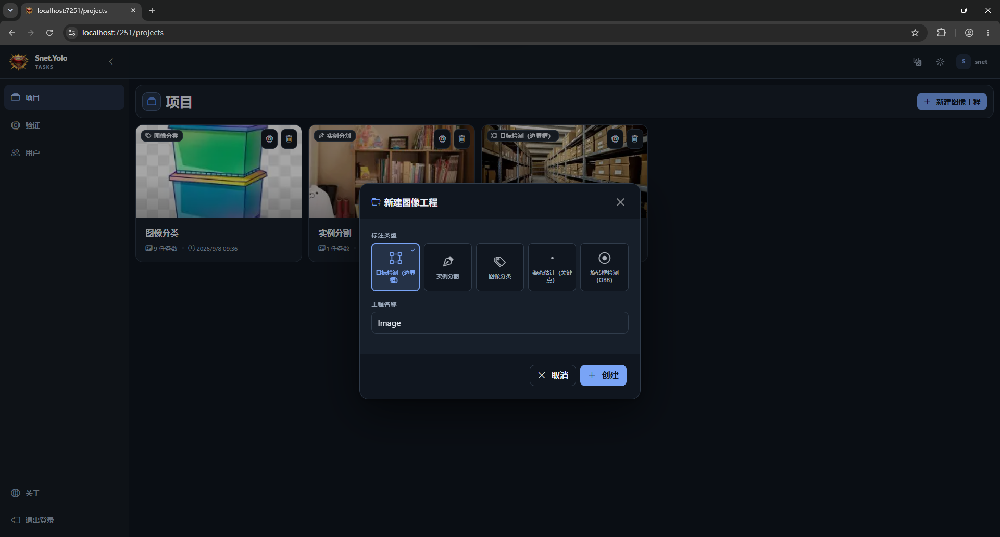
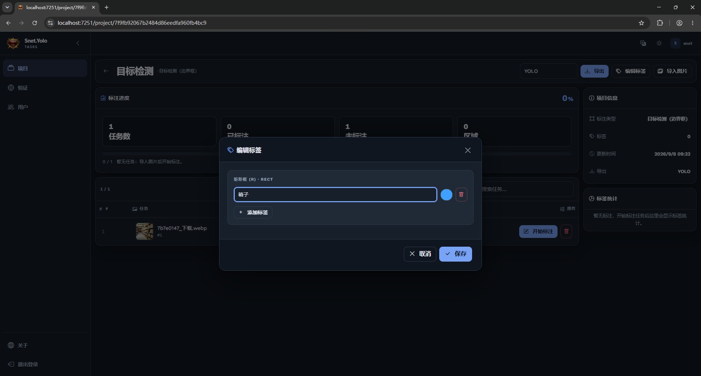
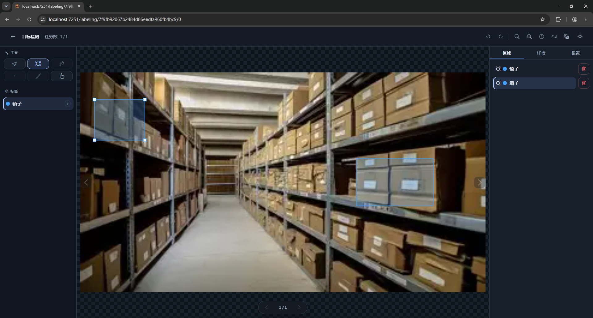
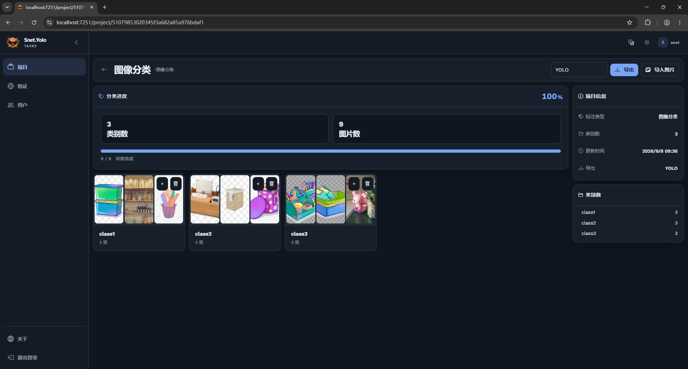
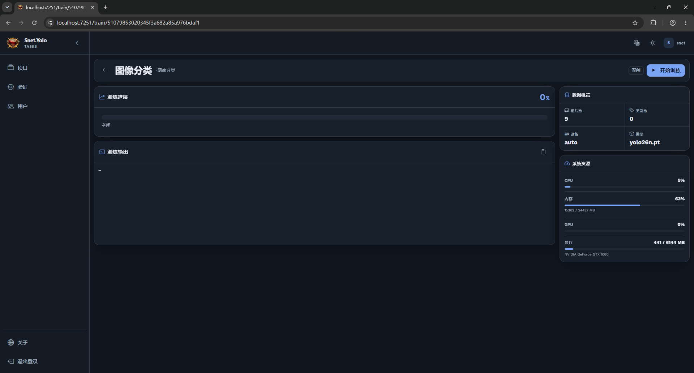
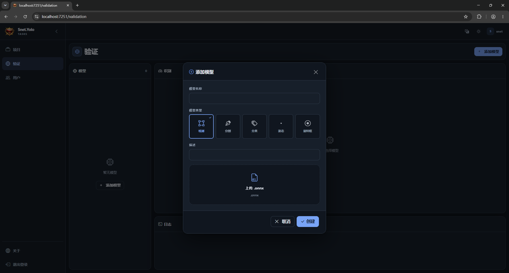
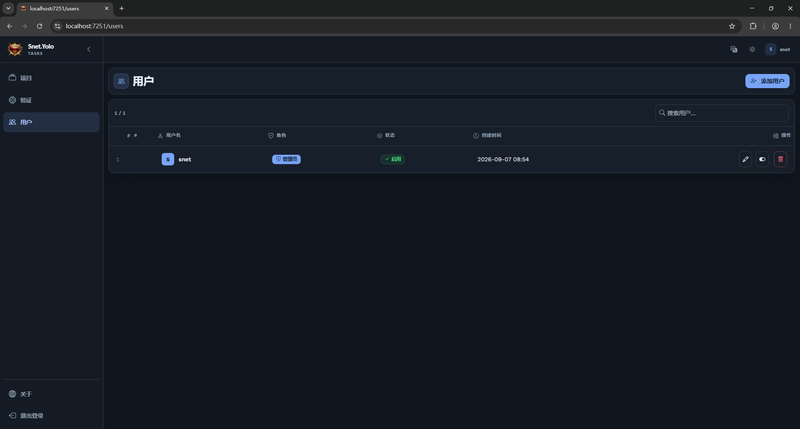

<h1 align="center">🔍 Snet.VisualIdentity</h1>

<p align="center">
  <br/>
</p>

<p align="center">
  <b>A .NET 10-based multi-model intelligent vision platform powered by YOLO</b>
</p>

<p align="center">
  
  
  
  
  
</p>

<p align="center">
  🚀 Efficient · 🧩 Flexible · 📦 Easy to deploy · 🔒 Secure
</p>

<p align="center">
  <a href="https://snet.cn"><b>🌐 Website</b></a> ·
  <a href="https://github.com/shunnet/VisualIdentity"><b>📦 GitHub</b></a> ·
  <a href="https://snet.cn/EaiUj"><b>🎬 Demo</b></a> ·
  <a href="https://www.nuget.org/packages/Snet.Yolo.Server"><b>📦 NuGet</b></a>
</p>

<p align="center">
  English | 📖 <a href="README.md"><b>简体中文</b></a>
</p>

## 📑 Table of Contents

| | | |
|---|---|---|
| [🌟 Introduction](#-introduction) | [🎯 Use Cases](#-use-cases) | [🏗️ Architecture](#-architecture) |
| [⚡ Quick Start](#-quick-start) | [🏷️ Tasks Workspace](#-tasks-web-annotation-and-training-workspace) | [🎬 Video & FFmpeg](#-ffmpeg-deployment-for-video-validation) |
| [🖥️ Interface Display](#-interface-display) | [📦 NuGet Installation](#-nuget-installation) | [🔌 API Reference](#-api-reference) |
| [⚙️ Configuration](#-configuration) | [🧠 Supported Tasks](#-supported-tasks) | [🖥️ Execution Providers](#-execution-providers) |
| [🐳 Docker Deployment](#-docker-deployment) | [🧪 Tests](#-testing) | [🔒 Security](#-security-features) |

## 🌟 Introduction

**VisualIdentity** is a ready-to-use intelligent recognition platform combining modern **.NET**, the high-performance inference engine [YoloDotNet](https://github.com/NickSwardh/YoloDotNet) and lightweight **SQLite** data management. It solves the pain point of "multi-model deployment + multi-task recognition" — **detection, classification, segmentation, pose estimation and oriented detection** are managed uniformly and switchable on demand.

> 💡 The `.NET` badge: the core library `Snet.Yolo.Server` multi-targets **net8.0 / net10.0**; the API services and tools are built on **.NET 10**.

### ✨ Core Features (Overview)

#### 🧠 Recognition & Models

| Feature | Description |
|---------|-------------|
| 🎯 **Five-in-One Recognition** | Object detection · OBB · classification · segmentation · pose estimation, managed uniformly and switchable on demand |
| 🧠 **Multi-Model Management** | SQLite-based model CRUD with versioning and quick switching |
| 🖱️ **Click an image to identify** | Selecting a photo on the validation page runs recognition automatically; videos (much slower) still use the Identify button and can be cancelled |
| 🔍 **Image viewer** | Double-click an image: wheel zoom anchored at the cursor · drag to pan · double-click or button to reset · an "Original" toggle in the header |
| 🎬 **Aggregated video results** | Video detections are summarized per label as average confidence + total occurrences instead of meaningless per-frame coordinates |
| ⚡ **Multi-Hardware Acceleration** | CPU · CUDA / TensorRT · OpenVINO · CoreML · DirectML behind one identical UI |
| 📊 **Real-Time Metrics** | Millisecond latency stats, batch validation & confidence analysis |

#### 🏷️ Tasks Web Workspace

| Feature | Description |
|---------|-------------|
| 🏷️ **End-to-end workspace** | Manage projects, import data, annotate five task types, export YOLO datasets, train and validate models in the browser |
| 📤 **Uninterrupted uploads** | Upload jobs are owned by the service: switching pages, coming back, or re-rendering never loses progress, and the banner can cancel at any time |
| 🗂️ **Per-model queues** | Every model keeps its own validation file queue, selection and results, restored after a browser refresh |
| 🎞️ **Image & video validation** | Up to 100 files per batch; videos are processed frame by frame in the background with live progress and ETA |
| 📥 **Incremental import** | YOLO ZIPs can be uploaded batch by batch: same-named classes are reused, new ones appended, and annotation indices remapped to project labels |
| 🐍 **Python Helper** | Built-in export script, one-click PyTorch → ONNX |
| 🖥️ **WPF Debug Tool** | Visual verification for 5 recognition modes + data unification tool |

#### 🏋️ Training

| Feature | Description |
|---------|-------------|
| 🔢 **300 epochs by default** | With small datasets, 50 epochs means only dozens of weight updates and the model learns nothing; Ultralytics early-stops via `patience` |
| 🎯 **No validation split by default** | Carving out 10% hurts small datasets; enable "use validation set (auto 10%)" in the training dialog when you need objective metrics |
| 🩺 **Dataset health check** | Logs per-class instance counts, image counts, target pixel sizes and validation size, warning about data that cannot possibly learn |
| 🔬 **Post-training check** | Reads mAP from `results.csv`; when the validation set is tiny it re-checks on the training set and states plainly whether the model learned anything |
| 📥 **One-line weight download** | When a proxy intercepts GitHub (curl 60), the log prints a system-specific `curl` command with the proxy/CA flags already filled in, and the target is reused automatically |

#### 🚀 Deployment & Operations

| Feature | Description |
|---------|-------------|
| 🌍 **Cross-Platform** | Windows · Linux · macOS · Docker |
| 🛠️ **FFmpeg self-check** | Runs on video upload: Windows shows a dialog (manual path / silent download+install), Linux installs globally through apt, and failures never block image flows |
| 🔤 **No more tofu boxes** | Video labels are drawn with a real CJK typeface; missing fonts are installed together with FFmpeg on Linux |
| 📦 **Ready to use** | Each task instance runs standalone; the core library `Snet.Yolo.Server` is available on NuGet with any one of five execution providers |

#### 🔒 Security & Performance

| Feature | Description |
|---------|-------------|
| 🔒 **Production-Grade Security** | CSRF protection · rate limiting · CORS control · security headers |
| 🔐 **Per-user isolation** | Projects, annotations, models, validation data and files are isolated per signed-in user while sharing the training environment |
| 🔄 **Model instance caching** | Reuse instances while the configuration is unchanged |
| 🧵 **Async end-to-end** | `async/await` across HTTP → GPU inference → disk writes |

> 📖 Details live in the sections below: [Tasks workspace](#-tasks-web-annotation-and-training-workspace) · [Video & FFmpeg](#-ffmpeg-deployment-for-video-validation) · [Configuration](#️-configuration) · [Security](#-security-features) · [Performance](#-performance)

## 🎯 Use Cases

| Scenario | Purpose | Recommended Models |
|----------|---------|--------------------|
| 🏭 **Industrial QC** | Defect detection, foreign-object recognition, part counting | Detection, Segmentation |
| 🛒 **Retail Analytics** | Customer behavior tracking, shelf product detection | Detection, Classification |
| 🛡️ **Smart Security** | Anomaly monitoring, fall detection, zone intrusion | Pose, Detection |
| 🚗 **Autonomous Driving** | Road target detection, traffic sign recognition | OBB, Detection |
| 🏥 **Medical Imaging** | Lesion segmentation, cell classification | Segmentation, Classification |
| 📄 **Document Analysis** | Rotated text detection, table recognition | OBB |
| 🌐 **Edge Computing** | Raspberry Pi / Jetson lightweight deployment | CPU, OpenVINO |

## 🏗️ Architecture

```
VisualIdentity/
├── Snet.Yolo.Server/              # 🧠 Core inference engine + data models (net8.0/net10.0)
├── Snet.Yolo.Api.Shared/          # 🔗 Shared API layer (Shared Project: controllers / security / imaging)
├── Snet.Yolo.Api.Cpu/             # 🖥️ CPU API (HTTP 5157 · HTTPS 7257)
├── Snet.Yolo.Api.Cuda/            # 🎮 CUDA / TensorRT API (HTTP 5158 · HTTPS 7258)
├── Snet.Yolo.Api.OpenVino/        # 🔌 OpenVINO API (HTTP 5159 · HTTPS 7259)
├── Snet.Yolo.Api.CoreML/          # 🍎 CoreML API (HTTP 5160 · HTTPS 7260)
├── Snet.Yolo.Api.DirectML/        # 🪟 DirectML API (HTTP 5161 · HTTPS 7261)
├── Snet.Yolo.Tasks.Core/          # 🏷️ Annotation configuration, editing, export and training domain logic
├── Snet.Yolo.Tasks.Shared/        # 🔗 Shared Tasks project (Blazor components, services and static assets)
├── Snet.Yolo.Tasks.Cpu/           # 🖥️ CPU Tasks (HTTP 5151 · HTTPS 7351)
├── Snet.Yolo.Tasks.Cuda/          # 🎮 CUDA / TensorRT Tasks (HTTP 5152 · HTTPS 7352)
├── Snet.Yolo.Tasks.DirectML/      # 🪟 DirectML Tasks (HTTP 5153 · HTTPS 7353)
├── Snet.Yolo.Tasks.OpenVino/      # 🔌 OpenVINO Tasks (HTTP 5154 · HTTPS 7354)
├── Snet.Yolo.Tasks.CoreML/        # 🍎 CoreML Tasks (HTTP 5155 · HTTPS 7355)
├── Snet.Yolo.Tool/                # 🛠️ WPF desktop debug tool
├── Snet.Yolo.Test/                # 🧪 Tests (xUnit unit tests + console integration tests)
├── Snet.Py/                       # 🐍 Python model export scripts
├── docker/                        # 🐳 CPU and CUDA image definitions for Tasks / API
└── appsettings.json               # ⚙️ Global configuration
```

### 🔄 Data Flow

```
Client uploads image → API controller (request validation) → rate-limit middleware
→ ManageOperate (query model path) → IdentityOperate (load model + accelerator)
→ YoloDotNet inference (GPU / CPU) → ResultHandler (result conversion)
→ ImageHandler (annotated drawing + disk storage) → JSON result + image URL
```

## ⚡ Quick Start

### 🧰 Prerequisites

- 📦 [.NET 10 SDK](https://dotnet.microsoft.com/download/dotnet/10.0)
- 🧠 At least one YOLO model in ONNX format ([export](#-onnx-model-export))

### 1️⃣ Clone

```bash
git clone https://github.com/shunnet/VisualIdentity.git
cd VisualIdentity
```

### 🏷️ Use the Tasks Web Workspace

```bash
# Pick one of the five hardware flavours (CPU flavour shown here)
dotnet run --project Snet.Yolo.Tasks.Cpu
```

Open `http://localhost:5151`. The first startup creates the default administrator `snet` with password `123456`. Set `SNET_BOOTSTRAP_ADMIN_PASSWORD` before starting to override it; the same variable can synchronize an existing administrator during account recovery.

> 🐍 Training also requires a working local Python installation. Tasks detects and creates a shared virtual environment before starting Ultralytics training for the selected task type.

🖥️ To select the validation inference hardware, run the corresponding project:

| Project | Execution provider | Target platform |
|---|---|---|
| `Snet.Yolo.Tasks.Cpu` | `YoloDotNet.ExecutionProvider.Cpu` | General-purpose CPU |
| `Snet.Yolo.Tasks.Cuda` | `YoloDotNet.ExecutionProvider.Cuda` | NVIDIA CUDA / TensorRT |
| `Snet.Yolo.Tasks.DirectML` | `YoloDotNet.ExecutionProvider.DirectML` | Windows GPU |
| `Snet.Yolo.Tasks.OpenVino` | `YoloDotNet.ExecutionProvider.OpenVino` | Intel OpenVINO |
| `Snet.Yolo.Tasks.CoreML` | `YoloDotNet.ExecutionProvider.CoreML` | macOS / Apple Silicon |

💡 For example: `dotnet run --project Snet.Yolo.Tasks.Cuda`. All five hardware projects import `Snet.Yolo.Tasks.Shared`; only the execution-provider factory and hardware NuGet package differ. The training environment remains shared.

### 2️⃣ Run the CPU API

```bash
cd Snet.Yolo.Api.Cpu
dotnet run
```

🌐 Open `http://localhost:5157/swagger` for Swagger UI (Development environment only).

### 3️⃣ Upload a Model & Infer

```bash
# 1. Upload ONNX model
curl -X POST http://localhost:5157/Operate/AddAsync \
  -F "file=@your_model.onnx" \
  -F "describe=my detection model" \
  -F "onnxType=ObjectDetection"

# 2. Fast inference (coordinates / labels / confidence only)
curl -X POST http://localhost:5157/Operate/IdentityAsync \
  -F "onnxIndex=1" -F "file=@test.jpg" \
  -F 'paramJson={"Confidence":0.2,"Iou":0.7}'

# 3. Full inference (annotated image + coordinates + image URL)
curl -X POST http://localhost:5157/Operate/IdentityDrawAsync \
  -F "onnxIndex=1" -F "file=@test.jpg" \
  -F 'paramJson={"Confidence":0.2,"Iou":0.7}'
```

## 🏷️ Tasks Web Annotation and Training Workspace

🧩 `Snet.Yolo.Tasks.Shared` contains the shared Blazor Web workspace implementation used by all five hardware projects; CPU environments use `Snet.Yolo.Tasks.Cpu`. The workspace covers the workflow from dataset preparation through model validation:

1. 🔐 Sign in, create a project, and choose a detection, segmentation, classification, pose, or OBB template.
2. 🖼️ Import images and annotate rectangles, oriented boxes, polygons, keypoints, or classes in the browser.
3. 📦 Export YOLO labels or a YOLO ZIP dataset containing the source images.
4. ⚙️ Configure epochs, image size, base model and device while viewing live training phases, metrics and logs.
5. 🚀 Download the resulting `best.pt`, or export ONNX and open it directly in the validation page.

### 📤 Upload center

🧭 Every upload entry point (project images, classification images, YOLO ZIP, validation images/videos, ONNX models) shares one persistent upload channel:

| Feature | Details |
|---|---|
| 🔄 **Survives navigation** | Jobs are owned by the service: switching pages, coming back, or re-rendering neither interrupts nor loses progress |
| 📊 **Visible progress** | The banner shows the current file, bytes, percentage and `completed / total`, then collapses when finished |
| ⏹️ **Cancellable** | Cancelling takes effect immediately (stream copies observe the token) and partially written files are cleaned up |
| 🧹 **Per-file failures** | A failing file only reports itself; the rest of the batch continues |

### 🖼️ Validation page

📤 Upload up to 100 images or videos at once; each model keeps its own file list and results, restored after a browser refresh:

| Interaction | Details |
|---|---|
| 🖱️ **Click an image** | Runs recognition **automatically** after loading, saving the "select then click Identify" step |
| 🎬 **Videos** | Decoding is slow, so they still start from the Identify button; the status pill shows the phase, frame progress and ETA |
| ⏹️ **Cancel anytime** | Queued video jobs are skipped and running ones abort frame extraction / per-frame inference / encoding (including killing the ffmpeg process) |
| 🔍 **Double-click** | Opens the viewer: cursor-anchored wheel zoom, drag to pan, reset via double-click or button, an "Original" toggle, Esc or click-outside to close |
| 📋 **Aggregated results** | Videos summarize per label as average confidence + total occurrences; photos keep per-object coordinates |

> 📌 Validation state (file queue, selection, results) lives only for the current Tasks process, is cleared on restart, and is never written to the business database.

### ✏️ Label editing semantics (label config = single source of truth)

The project's label config (`LabelConfigXml`) is the **single authoritative source**: the annotation canvas, region list, toolbar, statistics, export and training class list are all **derived from it at read time**, so no surface can drift with a stale label. Changes to **existing annotations** (delete/rename) are **reconciled once, on save**, across all of them:

| Action | Behaviour |
|---|---|
| ✏️ **Rename** | Every region using that label shows the new name; exported datasets and training class names change with it |
| 🎨 **Recolour** | Colours live only in the label configuration (regions store just the name), so the annotation page, region list and canvas update instantly |
| 🗑️ **Delete** | **All of that label's regions are deleted too** (no longer drawn, no longer counted, no longer silently dropped on export) and **no slot is kept**: later labels shift to a lower index |
| 🧾 **Index shift notice** | The confirmation dialog states that later labels shift; the changed class order also affects exported and training class names |
| 🔁 **Re-import stays safe** | YOLO ZIP import matches by **class name** (reuse when equal, append when new) and ignores the archive's id ordering, so shifting indices never misplace old data |

> 💡 Deleting unused labels keeps the class list dense with no empty classes; if you keep index-aligned snapshots outside the platform (old training logs), re-export once after the change.
#### 🖼️ Large-image previews on the validation page (originals are never compressed)

Images uploaded to the validation page are **stored untouched** (no server-side processing — upload speed stays exactly what your network gives you). To keep the UI smooth, the server generates a small preview:

| Stage | Behaviour |
|---|---|
| ⬆️ **Upload** | The original is written as-is; zero server work ✓ |
| 🔥 **Background warm-up** | A preview is generated quietly after the upload (~1–3 s per image; never blocks the upload, failures do not affect recognition) ✓ |
| 🖼️ **Display** | File list, main view and canvas overlay all use the preview (**a 75 MB BMP becomes ≈ 370 KB**), so the browser never decodes a 5120×5120 bitmap ✓ |
| 🔍 **Double-click viewer** | Loads the **original** (the whole point is inspecting detail; zooming stays sharp), falling back to the preview only if the original cannot be fetched ✓ |
| 🗑️ **Delete** | The preview is removed together with the original, and files created by this process are cleaned up on shutdown ✓ |

> 💡 Why CSS-only shrinking is not enough: the browser must **decode the whole bitmap** before scaling it — one 5120×5120 image costs about 100 MB of memory, and a few of them in a list are enough to block the main thread (which also starves the circuit heartbeat). Previews cut that decode cost from ~100 MB to a few MB, which is what actually makes it smooth.

| Setting (`appsettings.json`) | Default | Meaning |
|---|---|---|
| `Validation:Preview:Enabled` | `true` | Turn off to always show originals |
| `Validation:Preview:MaxEdge` | `1600` | Preview longest edge |
| `Validation:Preview:TargetBytes` | `409600` | Preview byte budget (400 KiB) |
| `Validation:Preview:StartQuality` / `MinQuality` | `82` / `60` | Preview JPEG quality range |

> 📌 Display-only: originals stay exactly as uploaded for download or reuse.
> ⚠️ Detection `Position` coordinates live in **original-image pixel space** (e.g. 5120) while the canvas shows the preview (1600): the front-end **scales boxes by the original dimensions** so the overlay lines up, and the original URL is passed as a fallback so an unavailable preview still falls back to drawing the full image.
### 📥 YOLO ZIP import (repeatable, incremental)

Package `classes.txt` + `images/` + `labels/` into a ZIP and upload it through "Import YOLO ZIP" on a detection project. Every rule below is validated up front — anything that does not match is rejected:

| Requirement | Details |
|---|---|
| 📄 `classes.txt` | One class name per line, or `index name`; indices must be contiguous from 0 |
| 🖼️ `images/` | jpg / jpeg / png / gif / webp / bmp, **paired one-to-one** with labels (no missing, no extra) |
| 🏷️ `labels/` | A `.txt` with the same basename, each line `class cx cy w h` (normalised 0~1; an empty file means a pure background image) |
| 📏 Size | ≤ 100 MiB per image, ≤ 10,000 images, ≤ 1 GiB per upload (split into parts when larger) |

Importing is **incremental** — upload batch after batch into the same project and annotations keep accumulating:

| Situation | Platform behaviour |
|---|---|
| An incoming class name matches an existing project label (**case-insensitive**) | The existing label is **reused**, keeping its original spelling; nothing is added |
| An incoming class name is new | Appended as a new label with a colour that does not clash with existing ones |
| Class indices inside the annotations | **Remapped** from the archive index to the project label name, so the archive ordering can be anything |
| Importing the same batch twice | Labels stay unique (idempotent); **images will be duplicated**, so do not re-upload a batch |
| Template labels shipped with the project (e.g. `Airplane` / `Car`) | Never removed; delete them in the label editor if unused, otherwise they become zero-sample classes during training |

> 💡 Keeping class names identical across batches is the one thing to maintain by hand — the name *is* the class identity.

### 🏋️ Training

| Feature | Details |
|---|---|
| 🔢 **300 epochs by default** | With small datasets, 50 epochs means only dozens of weight updates and the model learns nothing; Ultralytics early-stops via `patience` |
| 🎯 **No validation split by default** | Carving out 10% hurts small datasets; enable "use validation set" in the training dialog when you need objective metrics |
| 🩺 **Dataset health check** | Logs per-class instance counts, image counts, target pixel sizes and validation size, warning about data that cannot possibly learn |
| 🔬 **Post-training check** | Reads mAP from `results.csv`; when the validation set is tiny it re-checks on the **training set** at the UI's default confidence and states plainly whether the model learned anything |
| 📥 **Weight download command** | On certificate/download failures the log prints a copy-ready `curl` command (using `Training:Proxy` / `Training:CaBundle`) whose target is reused automatically |

🐍 The training environment (Python + venv + torch + ultralytics) is detected and provisioned by Tasks; proxies and CAs are controlled through the `Training` configuration section.

### 🎬 FFmpeg deployment for video validation

🎥 Video decoding requires both `ffmpeg` and `ffprobe`; image validation does not depend on them. **Uploading a video triggers a self-check**, and when the tools are missing:

| Platform | Behaviour |
|---|---|
| 🪟 **Windows** | A dialog lets the user **specify a path** (the `ffmpeg.exe` file or its folder) or **download and install silently** (latest build from [GyanD/codexffmpeg](https://github.com/GyanD/codexffmpeg/releases), extracted into `tools/ffmpeg/win-<arch>/`), with download/extract progress shown on the page |
| 🐧 **Linux (Ubuntu/Debian)** | No dialog: runs `sudo -n apt-get install -y ffmpeg` asynchronously with live progress, retries after `apt-get update` when needed, and only shows a dialog on failure (with a manual-path fallback) |
| 🍎 **macOS / other** | Dialog for a manual path (or install with `brew install ffmpeg` and let auto-discovery find it) |

📌 The resolved location is recorded in `tools/media-tools.json` and reused for video decoding; a missing CJK font is installed in the same run (`fonts-noto-cjk`) so Chinese labels are never drawn as boxes. **Download or install failures only raise a top notification and never block image upload or recognition.**

🔍 Discovery order (manual configuration always supported):

1️⃣ `MediaTools:FFmpegPath` / `MediaTools:FFprobePath` configuration.
2️⃣ `SNET_FFMPEG_PATH` / `SNET_FFPROBE_PATH` environment variables.
3️⃣ The installation record in `tools/media-tools.json` (written after a manual choice or an automatic install).
4️⃣ `tools/ffmpeg/<RID>/` below the application directory, such as `tools/ffmpeg/win-x64/` or `tools/ffmpeg/linux-x64/`.
5️⃣ The system `PATH` and common Windows/Linux/macOS installation directories.

#### 🪟 Manual install (Windows 10/11)

```powershell
# 🪄 winget (recommended)
winget install --id Gyan.FFmpeg --exact

# 🍫 or Chocolatey
choco install ffmpeg

# ✅ Open a new terminal and verify both commands
ffmpeg -version
ffprobe -version
```

💡 On Windows Server without `winget`, choose a Windows build from the [official FFmpeg download page](https://ffmpeg.org/download.html), add its `bin` directory to `PATH`, or configure that directory as `MediaTools:FFmpegPath`.

#### 🐧 Manual install (Ubuntu / Debian)

```bash
sudo apt update
sudo apt install -y ffmpeg
# 🔤 CJK fonts (needed by Chinese labels burned into result videos)
sudo apt install -y fonts-noto-cjk
ffmpeg -version
ffprobe -version
```

📦 The same `ffmpeg` package provides `ffprobe`; no separate package is required. Tasks performs both steps automatically — this is only the fallback for offline hosts or accounts without `sudo`.

#### 🧩 Manual install (other Linux distributions)

```bash
# 🎩 Fedora
sudo dnf install -y ffmpeg-free

# 🏔️ Arch Linux
sudo pacman -S ffmpeg

# 🏔️ Alpine Linux
sudo apk add ffmpeg

ffmpeg -version
ffprobe -version
```

💡 If the distribution repository does not provide FFmpeg, place both executables under `tools/ffmpeg/linux-x64/` or `tools/ffmpeg/linux-arm64/` in the published application directory, then run `chmod +x ffmpeg ffprobe`. You can also set `SNET_FFMPEG_PATH` and `SNET_FFPROBE_PATH` explicitly.

#### 🍎 Manual install (macOS)

```bash
brew install ffmpeg
ffmpeg -version
ffprobe -version
```

#### 🔧 Explicit path configuration

```json
{
  "MediaTools": {
    "FFmpegPath": "/opt/ffmpeg/bin/ffmpeg",
    "FFprobePath": "/opt/ffmpeg/bin/ffprobe",
    "InstallDirectory": "/opt/ffmpeg",
    "DiscoverInstalledTools": true
  }
}
```

📌 Either path value may also point to the directory containing both executables (including the usual `bin/` subdirectory of an extracted archive). `InstallDirectory` sets where automatic installs are placed (defaults to `tools/ffmpeg` under the application directory); setting `DiscoverInstalledTools` to `false` limits resolution to configuration, the install record and the install directory, which is handy for pinning one specific toolchain. If a tool is missing or an explicitly configured path is invalid, the video job stops immediately and reports the current operating system, CPU architecture, and supported configuration methods instead of spinning indefinitely.

🗄️ The workspace stores projects, users, and annotation metadata in SQLite. Projects, annotation tasks, validation models, and database queries are isolated by the signed-in user. Uploaded images live under `wwwroot/data/uploads/<username>/`, ONNX models under `wwwroot/onnxs/<username>/`, and training data and outputs under `train/users/<username>/`; only the `train/.env` training environment is shared. Existing unowned data is assigned to `snet` during upgrade. Deleting a task or project only removes the current user's associated files. Server-side cookie authentication protects workspace pages, uploads, model downloads, and the training hub; ordinary users neither see nor can access user management.

## 🖥️ Interface Display

<p align="center">
  
  
  
  
  
  
  
</p>

## 📦 NuGet Installation

💡 Use the core library in your own .NET project:

```bash
# Core inference library (required)
dotnet add package Snet.Yolo.Server

# Pick exactly ONE execution provider (⚠️ only one allowed)
dotnet add package YoloDotNet.ExecutionProvider.Cpu      # 🖥️ Generic CPU
dotnet add package YoloDotNet.ExecutionProvider.Cuda     # 🎮 NVIDIA GPU + TensorRT
dotnet add package YoloDotNet.ExecutionProvider.OpenVino # 🔌 Intel OpenVINO
dotnet add package YoloDotNet.ExecutionProvider.CoreML   # 🍎 Apple Silicon
dotnet add package YoloDotNet.ExecutionProvider.DirectML # 🪟 Windows GPU
```

### 💡 C# Example

```csharp
using SkiaSharp;
using Snet.Model.data;
using Snet.Yolo.Server;
using Snet.Yolo.Server.handler;
using Snet.Yolo.Server.models.data;
using Snet.Yolo.Server.models.@enum;
using YoloDotNet.ExecutionProvider.Cpu;
using YoloDotNet.Extensions;
using YoloDotNet.Models;

// Create an inference instance (cached automatically, reused while config is unchanged)
var identity = IdentityOperate.Instance(new IdentityData
{
    Hardware = new CpuExecutionProvider("/path/to/model.onnx"),
    IdentifyType = OnnxType.ObjectDetection,
    SN = "my-detector"
});

using SKImage image = SKImage.FromEncodedData("/path/to/image.jpg");

// Run inference
OperateResult result = await identity.RunAsync(new ObjectDetectionData
{
    Confidence = 0.23,  // confidence threshold
    Iou = 0.7,          // IoU threshold
    File = image.Encode().ToArray()
});

// Get results and draw bounding boxes
var detections = result.GetObjectDetectionResult()?.ToObjectDetection();
if (detections is { Count: > 0 })
{
    foreach (var d in detections)
        Console.WriteLine($"{d.Label.Name}: {d.Confidence:P1} @ {d.BoundingBox}");

    using SKBitmap annotated = image.Draw(detections);
    // Save or display annotated...
}

identity.Dispose(); // release GPU resources
```

## 🔌 API Reference

### 📋 Model Management

| Method | Path | Description | Auth |
|--------|------|-------------|------|
| `POST` | `/Operate/AddAsync` | Upload ONNX model file | None (place behind a trusted network or authentication gateway) |
| `POST` | `/Operate/UpdateAsync` | Update model description or type | None (place behind a trusted network or authentication gateway) |
| `POST` | `/Operate/DeleteAsync` | Delete model (optionally the file) | None (place behind a trusted network or authentication gateway) |
| `GET` | `/Operate/QueryAsync?index=1` | Query a specific model | None |
| `GET` | `/Operate/QueryAllAsync` | Query all models | None |

### 🧠 Inference

| Method | Path | Description | Returns |
|--------|------|-------------|---------|
| `POST` | `/Operate/IdentityAsync` | 🚀 Fast inference | Coordinates / labels / confidence only |
| `POST` | `/Operate/IdentityDrawAsync` | 🎨 Full inference | Coordinates + annotated image URL + original URL |

> 📌 Inference endpoints are **POST multipart/form-data** (`onnxIndex`, `file`, `paramJson` are form fields). Hardware-specific fields below are also sent as form fields:

| Hardware | Extra Fields |
|----------|--------------|
| 🎮 CUDA | `gpuid` (GPU ID), `trtConfig` (TensorRT config) |
| 🍎 CoreML | `adaptive` (adaptive mode, default `true`) |
| 🪟 DirectML | `gpuid` (GPU ID) |
| 🔌 OpenVINO | `openVino` (advanced config) |

### 🖼️ History Images

| Method | Path | Description |
|--------|------|-------------|
| `GET` | `/Operate/GetOriginalImage?name=xxx&type=ObjectDetection&date=yyyy-MM-dd` | Original image (date optional; latest match when omitted) |
| `GET` | `/Operate/GetMarkImage?name=xxx&type=ObjectDetection&date=yyyy-MM-dd` | Annotated image (date optional) |
| `GET` | `/Operate/GetImageDetails?name=xxx&type=ObjectDetection&date=yyyy-MM-dd` | Full details (original + annotated + coordinates JSON; date optional) |

### 🏥 Health Check

| Method | Path | Description |
|--------|------|-------------|
| `GET` | `/health` | Health check (`{"Status":"Healthy","Timestamp":"..."}`) |

### 🧾 `paramJson` Formats

| Task Type | JSON Format |
|-----------|-------------|
| Object Detection | `{"Confidence":0.2,"Iou":0.7}` |
| Oriented Detection | `{"Confidence":0.2,"Iou":0.7}` |
| Classification | `{"Classes":1}` |
| Pose Estimation | `{"Confidence":0.2,"Iou":0.7}` |
| Segmentation | `{"Confidence":0.2,"Iou":0.7,"PixelConfidence":0.65}` |

## ⚙️ Configuration

### ⚙️ `appsettings.json`

```json
{
  "AllowedOrigins": [],           // 🔒 CORS whitelist; empty array = reject all cross-origin
  "RateLimit": {
    "PermitLimit": 120,           // ⏱️ max requests per minute
    "WindowMinutes": 1,           // ⏱️ time window (minutes)
    "QueueLimit": 20              // ⏱️ max queue size after the limit
  },
  "ConfigModel": {
    "NameFormat": "yyyyMMddHHmmssffffff",              // 🏷️ filename time format
    "OriginalImageNamingFormat": "{0}-Original.jpeg",  // 🖼️ original image naming
    "ResultImageNamingFormat": "{0}-Result.jpeg",      // 🎨 annotated image naming
    "DetailsNamingFormat": "{0}-Details.ini",          // 📄 details file naming
    "RetentionDays": 30                                // 🗑️ history retention days
  },
  "Training": {
    "Proxy": "",        // 🌐 proxy for training/downloads (empty = inherit system settings), e.g. http://proxy.corp:8080
    "CaBundle": ""      // 🔐 CA bundle when a corporate proxy intercepts HTTPS; passed to pip / requests / curl
  },
  "MediaTools": {
    "FFmpegPath": "",             // 🎬 FFmpeg executable or folder; empty = auto-discovery (config → env → install record → bundled dir → PATH)
    "FFprobePath": "",            // 🎬 FFprobe likewise (defaults to the FFmpeg folder)
    "InstallDirectory": "",       // 📦 where automatic installs go; defaults to tools/ffmpeg under the application directory
    "DiscoverInstalledTools": true // 🔎 scan the system for an existing FFmpeg; false = only config, install record and install directory
  }
}
```

> 💡 In a corporate network the easiest path is to set `Training:Proxy` and `Training:CaBundle`, restart, and then copy the weight download command that training prints — it already carries `--cacert` / `-x`.

### 🌱 Environment Variables

| Variable | Description | Default |
|----------|-------------|---------|
| `ASPNETCORE_ENVIRONMENT` | Environment (`Development` / `Production`) | `Production` |
| `ASPNETCORE_URLS` | Listen address | `http://localhost:5157` |
| `SNET_BOOTSTRAP_ADMIN_PASSWORD` | Password for the Tasks `snet` administrator; when set it overrides the default and synchronizes the existing administrator at startup | `123456` |

> ⚠️ Swagger UI is enabled only in `Development`; it is disabled automatically in production.

## 🧠 Supported Tasks

| Classification | Detection | OBB | Segmentation | Pose |
|:---:|:---:|:---:|:---:|:---:|
| 🔖 Whole-image classification | 📦 Bounding boxes | 🔄 Rotated boxes | 🎭 Pixel-level masks | 🦴 Keypoints |
| Labels + confidence | Boxes + labels + confidence | Rotated boxes + angle | Masks + boxes + labels | Keypoints + boxes |
|  |  |  |  |  |

### 🦴 Pose Estimation — Built-in Fall Detection

🚨 `YoloPoseViewModel` integrates a real-time **fall detection algorithm** (`FallDetector`) analyzing 17 human keypoints across multiple dimensions:

| Dimension | Criterion | Configurable |
|-----------|-----------|--------------|
| 📏 Body height | Nose-ankle distance < 50% image height | `FlatHeightRatio` |
| 📐 Body tilt | Shoulder-hip line < 70° | `AngleThreshold` |
| ↔️ Torso levelness | Shoulder-hip Y delta < 10% image height | `TorsoHorizontalThresholdRatio` |
| 📍 Ground proximity | Mean keypoint Y > 60% image height | `GroundProximityRatio` |
| ✅ Final verdict | ≥ 2 criteria met → fall | `FallScoreThreshold` |

## ✅ Verified YOLO Models

The following YOLO models have been fully inference-tested with **YoloDotNet** and **Snet.Yolo.Server**:

| Classification | Detection | Segmentation | Pose | OBB |
|:---:|:---:|:---:|:---:|:---:|
| YOLOv8-cls | YOLOv5u | YOLOv8-seg | YOLOv8-pose | YOLOv8-obb |
| YOLOv11-cls | YOLOv8 | YOLOv11-seg | YOLOv11-pose | YOLOv11-obb |
| YOLOv12-cls | YOLOv9 | YOLOv12-seg | YOLOv12-pose | YOLOv12-obb |
| YOLOv26-cls | YOLOv10 | YOLOv26-seg | YOLOv26-pose | YOLOv26-obb |
| | YOLOv11 | | | |
| | YOLOv12 | | | |
| | YOLOv26 | | | |
| | YOLO-World (v2) | | | |
| | YOLO-E | | | |
| | RT-DETR | | | |

## 🖥️ Execution Providers

| Provider | Windows | Linux | macOS | Docker | Use Cases |
|----------|:---:|:---:|:---:|:---:|-----------|
| 🖥️ **CPU** | ✅ | ✅ | ✅ | ✅ | Generic inference, edge devices |
| 🎮 **CUDA / TensorRT** | ✅ | ✅ | ❌ | ✅ | NVIDIA GPU acceleration |
| 🔌 **OpenVINO** | ✅ | ❌ | ❌ | ❌ | Intel chip optimization |
| 🍎 **CoreML** | ❌ | ❌ | ✅ | ❌ | Apple Silicon (M1/M2/M3) |
| 🪟 **DirectML** | ✅ | ❌ | ❌ | ❌ | Generic Windows GPU |

> ⚠️ Each project/process may reference **exactly one** execution provider package. Mixing providers causes runtime conflicts (duplicate DLL loading, symbol clashes).

## 💡 ONNX Model Export

### 🐍 Via Python (Ultralytics)

```bash
pip install ultralytics
python Snet.Py/Snet.Py.py
```

### ⌨️ Manual Export

```bash
# YOLOv5u–YOLOv12 (opset 17)
yolo export model=yolov8n.pt format=onnx opset=17

# YOLOv26 (opset 18)
yolo export model=yolo26n.pt format=onnx opset=18
```

> 📌 Using the correct opset ensures best compatibility and inference performance with ONNX Runtime.

## 🐳 Docker Deployment

🎯 The release workflow packages all five execution providers for both Tasks and API. CPU targets `linux-x64`, `linux-arm64`, and `win-x64`; CUDA targets `linux-x64` and `win-x64`; DirectML and OpenVINO target `win-x64`; CoreML targets `osx-x64` and `osx-arm64`. Docker images are built only for Linux CPU and Linux CUDA; Windows containers are not built. The current OpenVINO NuGet package only contains Windows x64 native binaries.

### 🏗️ Build Images

```bash
# Linux CPU (Tasks includes ffmpeg, ffprobe, and Python)
docker build -t snet-yolo-tasks-cpu -f docker/Tasks.Cpu.Dockerfile .
docker build -t snet-yolo-api-cpu -f docker/Api.Cpu.Dockerfile .

# Linux CUDA (requires NVIDIA Container Toolkit at runtime)
docker build -t snet-yolo-tasks-cuda -f docker/Tasks.Cuda.Dockerfile .
docker build -t snet-yolo-api-cuda -f docker/Api.Cuda.Dockerfile .

```

### 🚀 Run a Container

```bash
# CPU Tasks Web workspace
docker run -d --name snet-yolo-tasks-cpu -p 8080:8080 \
  -v snet-tasks-data:/app/wwwroot/data \
  -v snet-tasks-db:/app/wwwroot/db \
  -v snet-tasks-train:/app/train \
  snet-yolo-tasks-cpu

# Confirm that both media tools are available inside the image
docker exec snet-yolo-tasks-cpu ffmpeg -version
docker exec snet-yolo-tasks-cpu ffprobe -version

# CPU API
docker run -d -p 8080:8080 \
  -v /path/to/models:/app/wwwroot/onnxs \
  -v /path/to/data:/app/wwwroot \
  snet-yolo-api-cpu

curl http://localhost:8080/health   # health check
curl http://localhost:8080/Operate/QueryAll
```

> 📝 The Debian `ffmpeg` package in Linux Tasks images provides both `ffmpeg` and `ffprobe`. CoreML depends on macOS system frameworks and cannot run in Docker.

## 🧪 Testing

```bash
# 🧪 Unit tests (xUnit): upload center, training orchestration, dataset export/health checks,
# validation results, media tools and FFmpeg provisioning
dotnet test Snet.Yolo.Test/Snet.Yolo.Test.csproj

# 🖥️ Console integration tests (require a real model and image)
cd Snet.Yolo.Test
export YOLO_IMAGE_PATH="/path/to/test.jpg"
export YOLO_MODEL_PATH="/path/to/model.onnx"
export YOLO_TYPE="ObjectDetection"
dotnet run
```

## 🔒 Security Features

| Feature | Implementation | Configuration |
|---------|----------------|---------------|
| 🌐 **CORS** | `RestrictedOrigins` policy | `appsettings.json` → `AllowedOrigins` |
| 🛡️ **CSRF** | Antiforgery tokens for cookie-authenticated Tasks forms; standalone APIs remain stateless-client compatible | Browser login/logout forms |
| ⏱️ **Rate Limiting** | Fixed window algorithm | `RateLimit` section |
| 🔐 **Security Headers** | Middleware injection | X-Content-Type-Options / X-Frame-Options / CSP, etc. |
| 📁 **Filename Sanitization** | Path traversal filtering + GUID uniqueness | Upload handling |
| 📏 **File Size Limit** | Kestrel + FormOptions dual limit | 1 GB request body cap |
| 🧹 **Auto Cleanup** | `HistoryFileHandler` scheduled task | `RetentionDays` (default 30) |

## 📈 Performance

| Optimization | Description |
|--------------|-------------|
| 🔄 **Model Instance Caching** | Reuse instances while config is unchanged |
| 🧵 **Async End-to-End** | `async/await` across HTTP → GPU → disk |
| 🖼️ **Parallel Disk Writes** | Original / annotated / details via `Task.WhenAll` |
| 💾 **Memory Optimization** | `SKBitmap.Freeze()` cross-thread sharing, `using`-guaranteed dispose |

### ⏱️ Latency Breakdown (reference, CPU mode)

```
HTTP receive      ~   5ms
Image decode      ~  20ms
ONNX inference    ~ 150ms (model & hardware dependent)
Result conversion ~   5ms
Annotation draw   ~  30ms (IdentityDraw only)
Disk write        ~  10ms (parallel, non-blocking)
────────────────────────
Fast total        ~ 180ms
Full total        ~ 220ms
```

## 📚 Dependencies

| Component | Description |
|-----------|-------------|
| 🔗 **Snet.DB** | Dual ORM (Dapper & SqlSugarCore), auto table creation, Code-First |
| ⚡ **YoloDotNet** | Ultra-fast production-grade YOLO inference, YOLOv5u → YOLOv26 |
| 🎨 **SkiaSharp** | Cross-platform 2D rendering: decode, annotation, keypoints |
| 🗄️ **SQLite** | Embedded database: model metadata management |

## 🙏 Acknowledgements

| Project | Description |
|---------|-------------|
| 🌐 [Snet.cn](https://snet.cn) | Official website |
| 🔥 [Ultralytics](https://github.com/ultralytics/ultralytics) | YOLO training & export |
| ⚡ [YoloDotNet](https://github.com/NickSwardh/YoloDotNet) | .NET YOLO inference engine |
| 🖥️ [Snet.Windows.Controls](https://github.com/shunnet/WpfMUI) | Modern WPF UI framework |
| 🗄️ [SqlSugarCore](https://github.com/DotNetNext/SqlSugar) | ORM framework |
| 🎨 [SkiaSharp](https://github.com/mono/SkiaSharp) | Cross-platform graphics |

## 📜 License


⚖️ This project is licensed under the **MIT** License — free to use, modify and distribute.

📄 See the [LICENSE](LICENSE) file for the full terms.

> ⚠️ The software is provided "as is", without warranty of any kind.

## 📈 Star History

<a href="https://www.star-history.com/?repos=shunnet%2FVisualIdentity&type=date&legend=bottom-right">
 <picture>
   <source media="(prefers-color-scheme: dark)" srcset="https://api.star-history.com/chart?repos=shunnet/VisualIdentity&type=date&theme=dark&legend=bottom-right&sealed_token=jvjH1AZFSXflOGVE7gveyIW2Bq008loM9hOu9VceYDivd2bPkD0fEyfe8zFiqRkP-XIlgwg-b5OQTyLQq9rBBx_ERIk7NBQmgWubF8Akb13yd8u0s1ZBLA"/>
   <source media="(prefers-color-scheme: light)" srcset="https://api.star-history.com/chart?repos=shunnet/VisualIdentity&type=date&legend=bottom-right&sealed_token=jvjH1AZFSXflOGVE7gveyIW2Bq008loM9hOu9VceYDivd2bPkD0fEyfe8zFiqRkP-XIlgwg-b5OQTyLQq9rBBx_ERIk7NBQmgWubF8Akb13yd8u0s1ZBLA"/>
   
 </picture>
</a>
