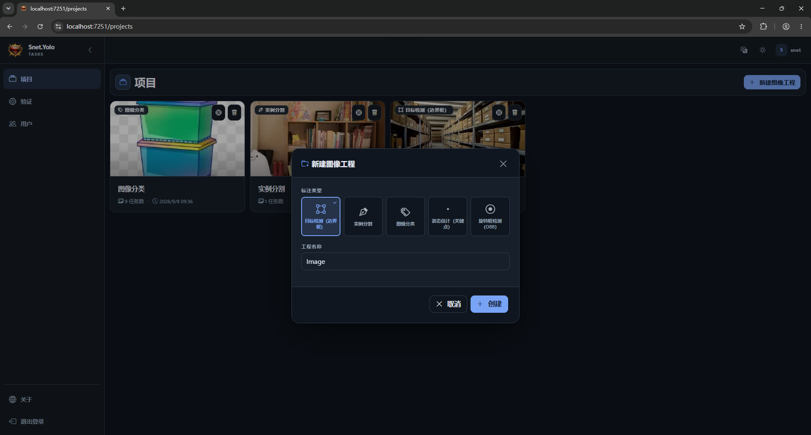
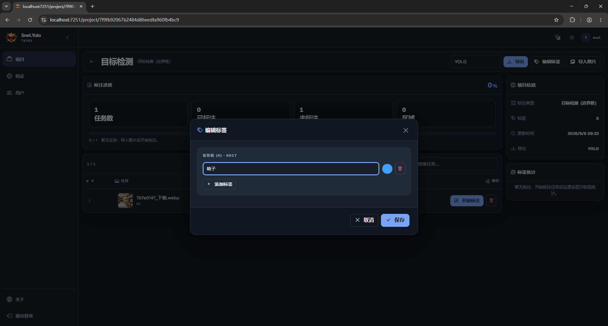
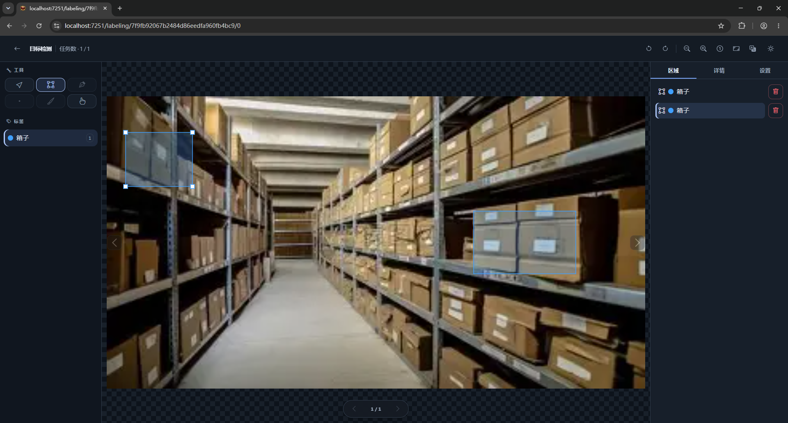
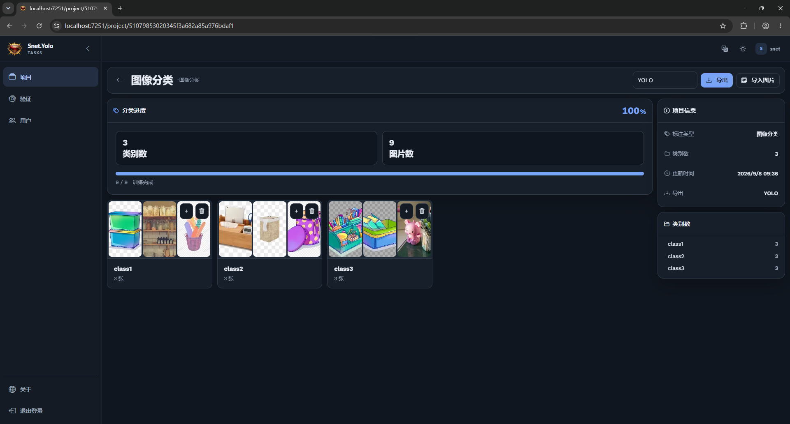
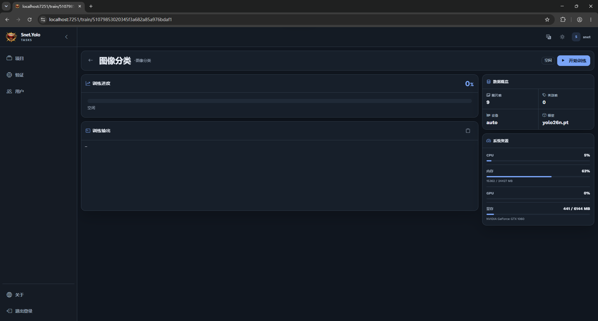
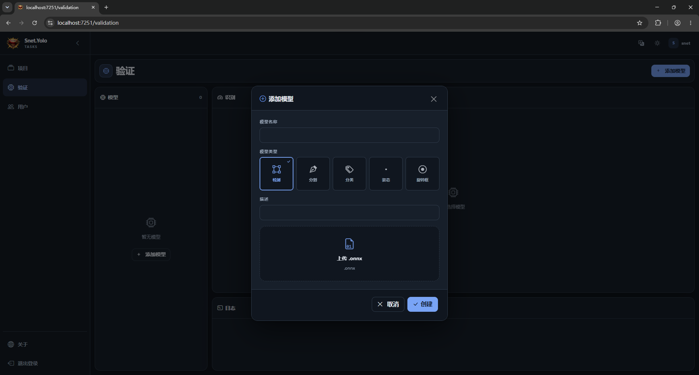
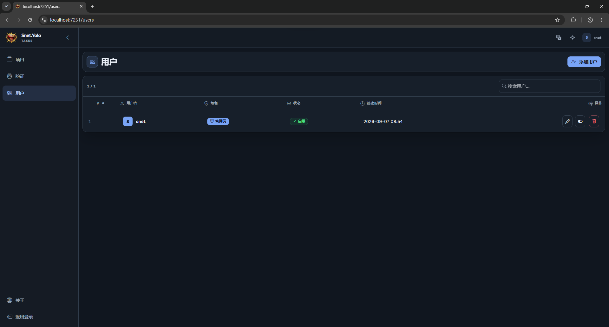

<h1 align="center">🔍 Snet.VisualIdentity</h1>

<p align="center">
  <br/>
</p>

<p align="center">
  <b>A .NET 10 industrial vision platform for YOLO and Anomalib</b>
</p>

<p align="center">
  
  
  
  
</p>

<p align="center">
  🚀 Efficient · 🧩 Flexible · 📦 Easy to deploy · 🔒 Secure
</p>

<p align="center">
  <a href="https://snet.cn"><b>🌐 Website</b></a> ·
  <a href="https://github.com/shunnet/VisualIdentity"><b>📦 GitHub</b></a> ·
  <a href="https://snet.cn/EaiUj"><b>🎬 Demo</b></a> ·
  <a href="https://www.nuget.org/packages/Snet.Yolo.Server"><b>📦 NuGet</b></a>
</p>

<p align="center">
  English | 📖 <a href="README.md"><b>简体中文</b></a>
</p>

## 📑 Table of Contents

| | | |
|---|---|---|
| [🌟 Introduction](#-introduction) | [🎯 Use Cases](#-use-cases) | [🏗️ Architecture](#-architecture) |
| [⚡ Quick Start](#-quick-start) | [🏷️ Tasks Workspace](#-tasks-web-annotation-and-training-workspace) | [🎬 Video & FFmpeg](#-ffmpeg-deployment-for-video-validation) |
| [🖥️ Interface Display](#-interface-display) | [📦 NuGet Installation](#-nuget-installation) | [🔌 API Reference](#-api-reference) |
| [⚙️ Configuration](#-configuration) | [🧠 Supported Tasks](#-supported-tasks) | [🖥️ Execution Providers](#-execution-providers) |
| [🐳 Docker Deployment](#-docker-deployment) | [🧪 Tests](#-testing) | [🔒 Security](#-security-features) |
| [🪄 SAM Assistance](#-sam-assisted-point-annotation) | [🧩 Joint Verification Demo](#-joint-verification-console-demo) | [📚 Dependencies](#-dependencies) |

## 🌟 Introduction

**VisualIdentity** is a **.NET 10** vision platform for project management, image annotation, model training, ONNX validation, and API access. **YOLO** covers five tasks—object detection, classification, instance segmentation, pose estimation, and oriented detection—using labeled data to recognize objects and known defects. **Anomalib** trains on normal images to locate regions that differ from expected appearance without labeling every defect type. The two model families are managed separately, share inference capabilities in `Snet.Yolo.Server`, and have CPU and CUDA editions. **SAM** assists rectangle, polygon, and brush annotation through object point prompts, with MobileSAM, SAM 2.1 Tiny, SAM ViT-B/L/H, and SAM 3 Tracker image point segmentation; results are saved after manual confirmation.

For industrial inspection, Anomalib can answer “where is the anomaly?” and a YOLO model trained on the relevant defect classes can answer “what kind of defect is it?” Tasks provides a **Joint Validation** page that selects the signed-in user's existing models, runs both on the same image, and associates known detections with anomaly regions. Either model can also run alone for comparison.

Validation calls `Snet.Yolo.Server` in-process, without an HTTP API hop: YOLO model upload and per-user lookup reuse `ManageOperate`, while Server runs YOLO inference; `AnomalibModelRegistry` handles Anomalib packages and Server runs their ONNX inference. Joint Validation also queries both model families, runs inference, and matches results inside Server. Tasks owns the UI, upload progress, signed-in user identity, and video orchestration.

> 💡 The solution now targets **.NET 10** throughout; the WPF tool targets `net10.0-windows`.

### ✨ Core Features (Overview)

#### 🧠 Recognition & Models

| Feature | Description |
|---------|-------------|
| 🎯 **Five YOLO Tasks** | Object detection · OBB · classification · instance segmentation · pose estimation, managed uniformly and switchable on demand |
| 🔎 **Anomalib Localization** | Train PaDiM or EfficientAD Small on normal images; validation returns anomaly scores, regions, and heatmaps |
| 🧠 **Separate Model Management** | YOLO models use SQLite; Anomalib models are registered per user and support ONNX package import, download, and deletion |
| 🖱️ **Image validation** | YOLO and Anomalib have separate validation pages; Joint Validation offers combined recognition, Anomalib-only, and YOLO-only modes |
| 🔍 **Image viewer** | Open a thumbnail to inspect the original image, zoom, pan, and browse images; the YOLO result viewer can also toggle the original |
| 🎬 **Video validation** | YOLO aggregates detections by label; Anomalib counts anomalous frames and exports a video annotated with regions |
| ⚡ **Hardware Execution** | YOLO supports CPU and NVIDIA CUDA / TensorRT; Anomalib ONNX inference supports CPU / CUDA; Tasks and API share Server core logic |
| 📊 **Inference statistics** | Inference timings, target confidence, anomaly regions, and video progress; throughput depends on the model and hardware |

#### 🏷️ Tasks Web Workspace

| Feature | Description |
|---------|-------------|
| 🏷️ **Dual-model workspace** | Manage, annotate, train, and validate YOLO projects; upload normal images, train, and validate Anomalib projects |
| 📤 **Upload progress** | The upload center retains jobs within one browser connection; navigation preserves progress/cancellation, but refresh does not guarantee resumption |
| 🗂️ **Refresh recovery** | YOLO keeps queues per user/model; Anomalib and Joint Validation retain files, selections, parameters, and results per user, within the current application process |
| 🎞️ **Image & video validation** | Up to 100 files per batch; videos are processed frame by frame in the background with live progress and ETA |
| 📥 **Incremental import** | YOLO ZIPs can be uploaded batch by batch: same-named classes are reused, new ones appended, and annotation indices remapped to project labels |
| 🪄 **SAM annotation** | Foreground points, Shift-click background points, Enter to confirm, Esc to cancel; model, enabled state, and device preferences are restored |
| 🐍 **Model export** | Tasks exports trained YOLO ONNX models; the standalone Python script accepts weights, format, opset, and device |
| 🧩 **Joint Validation Demo** | A standalone console calls Core → Server and saves annotated images, heatmaps, and structured results for integration |
| 🖥️ **WPF Debug Tool** | Visual verification for five YOLO tasks and data preparation; SAM, Anomalib, and Joint Validation pages belong to Tasks |

#### 🏋️ Training

| Feature | Description |
|---------|-------------|
| 🔢 **500 epochs by default** | YOLO and EfficientAD use a 100–10,000 slider in steps of 100; PaDiM fits feature statistics and has no epoch control; YOLO may stop early |
| 🎯 **No validation split by default** | YOLO uses all training data by default; enable "use validation set (auto 10%)" in the training dialog when you need objective metrics |
| 🩺 **Dataset health check** | Logs per-class instance counts, image counts, target sizes, and validation size; warns about missing classes, small targets, and insufficient data |
| 🔬 **Post-training check** | Reads `results.csv` metrics and checks the training set at confidence 0.25 when metrics are suspect or validation samples are insufficient; diagnostic results do not replace evaluation on an independent test set |
| 📥 **One-line weight download** | When a proxy intercepts GitHub (curl 60), the log prints a system-specific `curl` command with the proxy/CA flags already filled in, and the target is reused automatically |
| 🔎 **Anomalib registration gates** | Export ONNX after training, check agreement with the trained model, and reject models exceeding 5% false positives on held-out normal images |

#### 🚀 Deployment & Operations

| Feature | Description |
|---------|-------------|
| 🌍 **Multi-platform Releases** | WPF on Windows; Tasks/API packages for Windows and Linux; Linux Docker images |
| 🛠️ **FFmpeg self-check** | Runs on video upload: Windows shows a dialog (manual path / silent download+install), Linux installs globally through apt, and failures never block image flows |
| 🔤 **CJK Text Rendering** | Video labels use a CJK font; Linux installation is attempted, while offline/unprivileged hosts require a supplied font |
| 📦 **Ready to use** | CPU and CUDA/TensorRT products run independently; core and provider packages can also be consumed from NuGet |

#### 🔒 Security & Performance

| Feature | Description |
|---------|-------------|
| 🔒 **Explicit Security Boundary** | Tasks uses cookie login and CSRF protection; the API is intentionally anonymous with rate limiting, CORS, and security headers |
| 🔐 **Per-user Tasks isolation** | Projects, annotations, models, validation data, and files are isolated per signed-in user while sharing the training environment; API models use a separate service account |
| 🔄 **Session lifetime** | The YOLO API caches sessions; Anomalib caches within its inference service; SAM retains at most one session pair; Tasks YOLO image validation creates and disposes a session per request |
| 🧵 **Async task handling** | Uploads, training orchestration, and file I/O run asynchronously; long video recognition shows progress and supports cancellation |

> 📖 Details live in the sections below: [Tasks workspace](#-tasks-web-annotation-and-training-workspace) · [Video & FFmpeg](#-ffmpeg-deployment-for-video-validation) · [Configuration](#-configuration) · [Security](#-security-features) · [Performance](#-performance)

## 🎯 Use Cases

💡 These are application directions enabled by the models, not built-in business systems. Tracking, alerts, clinical decisions, and similar workflows require appropriate models, rules, and field validation.

| Scenario | Purpose | Recommended Models |
|----------|---------|--------------------|
| 🏭 **Industrial QC** | Locate suspicious regions, then identify known defect classes; also detect foreign objects and count parts | Anomalib, Detection, Segmentation |
| 🛒 **Retail Analytics** | Customer behavior tracking, shelf product detection | Detection, Classification |
| 🛡️ **Smart Security** | Anomaly monitoring, fall detection, zone intrusion | Pose, Detection |
| 🚗 **Autonomous Driving** | Road target detection, traffic sign recognition | OBB, Detection |
| 🏥 **Medical Imaging** | Lesion segmentation, cell classification | Segmentation, Classification |
| 📄 **Document Analysis** | Rotated text detection, table recognition | OBB |
| 🌐 **Edge Computing** | Windows/Linux x64 CPU and Linux ARM64 CPU; CUDA releases target x64 NVIDIA environments | CPU, CUDA |

## 🏗️ Architecture

```
VisualIdentity/
├── YoloDotNet/                    # 🧠 ONNX parsing, preprocessing and postprocessing
├── YoloDotNet.ExecutionProvider.Cpu/  # 🖥️ CPU execution provider
├── YoloDotNet.ExecutionProvider.Cuda/ # 🎮 CUDA / TensorRT execution provider
├── Snet.Yolo.Server/              # 🗄️ SQLite, YOLO / anomalib / sam inference and joint matching
├── Snet.Yolo.Api.Shared/          # 🔗 Shared API layer (Shared Project: controllers / security / imaging)
├── Snet.Yolo.Api.Cpu/             # 🖥️ CPU API (HTTP 5157 · HTTPS 7257)
├── Snet.Yolo.Api.Cuda/            # 🎮 CUDA / TensorRT API (HTTP 5158 · HTTPS 7258)
├── Snet.Yolo.Tasks.Core/          # 🏷️ Annotation configuration, editing, export and training domain logic
├── Snet.Yolo.Tasks.Shared/        # 🔗 Shared Tasks project (Blazor components, services and static assets)
├── Snet.Yolo.Tasks.Cpu/           # 🖥️ CPU Tasks (HTTP 5151 · HTTPS 7351)
├── Snet.Yolo.Tasks.Cuda/          # 🎮 CUDA / TensorRT Tasks (HTTP 5152 · HTTPS 7352)
├── Snet.Yolo.Tool/                # 🛠️ WPF desktop debug tool
├── Snet.Yolo.Test/                # 🧪 xUnit regression and integration tests
├── Snet.VisualIdentity.JointVerificationDemo/ # 🧩 Standalone joint validation console and solution
├── Snet.Py/                       # 🐍 Python model export scripts
├── .github/workflows/release.yml   # 🚀 Build, tests, packages, and GHCR releases
├── docker/                        # 🐳 CPU and CUDA image definitions for Tasks / API
├── VisualIdentity.sln             # 🧩 Solution entry point
└── appsettings.json               # ⚙️ Shared API configuration
```

📌 Ports above come from development `launchSettings.json`. Set listening addresses explicitly for published deployments; development ports are not fixed production defaults.

### 🔄 Data Flow

```
Tasks (signed-in user)
├─ YOLO validation → ManageOperate → YoloValidationService → IdentityOperate → YoloDotNet
├─ Anomalib validation → AnomalibModelRegistry → AnomalibOnnxInference
├─ Joint Validation → JointValidationService → Anomalib → YOLO (if anomalous) → JointValidationMatcher
└─ SAM annotation → SamModelStore / SamOnnxRuntime → mask → save after confirmation

HTTP API (separate host, anonymous endpoints)
├─ YOLO → rate limiting / validation → ManageOperate → cached inference session → JSON
│                                              └─ IdentityDrawAsync → images and details on disk
└─ Anomalib → rate limiting / validation → AnomalibModelRegistry → ONNX → JSON / optional heatmap
```

## ⚡ Quick Start

### 🧰 Prerequisites

- 📦 [.NET 10 SDK](https://dotnet.microsoft.com/download/dotnet/10.0)
- 🧠 Direct validation/API inference needs a business model: YOLO ONNX, or Anomalib ONNX plus its manifest; alternatively train through Tasks first.
- 🐍 Training needs Python 3, pip, and venv; SAM annotation and ONNX validation do not use the Python training environments.
- 🎮 CUDA inference requires compatible NVIDIA drivers and CUDA/cuDNN; video validation additionally needs FFmpeg/FFprobe.
- 🗄️ The runtime account needs write access to data, models, training, SAM, and tool directories.

### 1️⃣ Clone

```bash
git clone https://github.com/shunnet/VisualIdentity.git
cd VisualIdentity
```

### 🏷️ Use the Tasks Web Workspace

```bash
# CPU variant
dotnet run --project Snet.Yolo.Tasks.Cpu
```

Open `http://localhost:5151`. The first startup creates the default administrator `snet` with password `123456`. Set `SNET_BOOTSTRAP_ADMIN_PASSWORD` before starting to override it; the same variable can synchronize an existing administrator during account recovery.

> 🔐 Set a non-default administrator password before deployment and serve through HTTPS or a trusted reverse proxy.
> 🐍 Tasks creates separate shared environments for YOLO and Anomalib; training devices are selected by Python/PyTorch, not by the CPU/CUDA host.

🖥️ To select the validation inference hardware, run the corresponding project:

| Project | Execution provider | Target platform |
|---|---|---|
| `Snet.Yolo.Tasks.Cpu` | `YoloDotNet.ExecutionProvider.Cpu` | General-purpose CPU |
| `Snet.Yolo.Tasks.Cuda` | `YoloDotNet.ExecutionProvider.Cuda` | NVIDIA CUDA / TensorRT |

💡 For example: `dotnet run --project Snet.Yolo.Tasks.Cuda`. The CPU and CUDA projects both import `Snet.Yolo.Tasks.Shared`; only the execution provider differs. The training environment remains shared.

### 2️⃣ Run the CPU API

```bash
cd Snet.Yolo.Api.Cpu
dotnet run
```

🌐 Open `http://localhost:5157/swagger` for Swagger UI (Development environment only).

### 3️⃣ Upload a Model & Infer

```bash
# 1. Upload ONNX model
curl -X POST http://localhost:5157/Operate/AddAsync \
  -F "file=@your_model.onnx" \
  -F "describe=my detection model" \
  -F "onnxType=ObjectDetection"

# 2. Fast inference (coordinates / labels / confidence only)
curl -X POST http://localhost:5157/Operate/IdentityAsync \
  -F "onnxIndex=1" -F "file=@test.jpg" \
  -F 'paramJson={"Confidence":0.2,"Iou":0.7}'

# 3. Full inference (annotated image + coordinates + image URL)
curl -X POST http://localhost:5157/Operate/IdentityDrawAsync \
  -F "onnxIndex=1" -F "file=@test.jpg" \
  -F 'paramJson={"Confidence":0.2,"Iou":0.7}'
```

## 🏷️ Tasks Web Annotation and Training Workspace

🧩 `Snet.Yolo.Tasks.Shared` contains the shared Blazor Web workspace implementation used by the CPU and CUDA projects; CPU environments use `Snet.Yolo.Tasks.Cpu`. The workspace covers the workflow from dataset preparation through model validation:

1. 🔐 Sign in, create a project, and choose a detection, segmentation, classification, pose, or OBB template.
2. 🖼️ Import images and annotate rectangles, oriented boxes, polygons, keypoints, or classes in the browser.
3. 📦 Export YOLO labels or a YOLO ZIP dataset containing the source images.
4. ⚙️ Configure epochs, image size, base model and device while viewing live training phases, metrics and logs.
5. 🚀 Download the resulting `best.pt`, or export ONNX and open it directly in the validation page.

### ✏️ Image polygon and curve annotation

Close a manual polygon by clicking its first vertex, double-clicking, or pressing Enter. With the selection tool, select a polygon to reveal vertex/curve controls. Drag square handles to move vertices and round handles to edit curve controls. At least three vertices remain; removing one joins its neighbors with a straight edge. Esc cancels a drag; Ctrl+Z / Ctrl+Shift+Z undo/redo edits.

Annotation JSON retains percentage-based control points in `value.snet_bezier` for editable reloads. YOLO segmentation and COCO exports flatten curves into polygons with at most 0.5px error in original-image coordinates, without changing the editable annotation. Third-party JSON tools unaware of this extension only read the anchors. This feature is image-only and does not include video tracking.

### 🪄 SAM-assisted point annotation

The model, assistance toggle and selected device are saved per signed-in user in the current browser and restored after refresh; unavailable GPUs revert to CPU. Prompt points and unconfirmed previews are not persisted. Preferences cannot survive refresh when browser local storage is disabled.

**Compute device**: All six SAM models support CPU or one selected NVIDIA GPU. The UI detects GPU indices, names and VRAM and reuses training-style device buttons and hardware cards for manual selection; CPU is the default. CPU distributions only enable CPU; GPU requires the CUDA distribution and compatible drivers, CUDA/cuDNN. GPU initialization failures are reported, not silently downgraded to CPU; unsupported ONNX operators may still run on CPU. This interactive single-image pipeline does not support joint multi-GPU inference, so there is no multi-selection. Switching devices clears previews and image features; the next click creates sessions on the selected device. Only one session pair remains resident; different users switching models or devices incur reload overhead.

Enable **SAM assistance** below the tools, choose rectangle, polygon or brush, and click an object to preview it. Additional clicks include foreground; Shift+click excludes background. Click **Confirm annotation** to save. Rectangles use object bounds, polygons use a simplified outer contour, and brushes use a filled mask. Disable SAM for manual tools. SAM does not classify objects or guarantee accurate one-click boundaries; review its output.

Choose **MobileSAM (default), SAM 2.1 Tiny, SAM ViT-B, SAM ViT-L, SAM ViT-H, or SAM 3 (points)** below the tools, with file-size and resource hints shown alongside. `Snet.Yolo.Server` runs ONNX directly, without the API or a Python environment. CPU/CUDA hosts reuse existing ONNX hardware configuration. Encoding is reused per image and model; switching either clears unconfirmed previews, releases page features, and cancels pending requests. The first download checks upstream for the latest weights in the application's verified compatibility catalog, pins the actual repository commit, and verifies SHA-256 for archives, ONNX and external weights. Toggle again to retry after failure. Only one model session pair is resident; old sessions are released before loading another model to avoid holding multiple models in RAM/VRAM. Different choices across users add model reload overhead.

**Versions and updates**: When SAM is enabled, the installed commit and **Check for updates** are shown. **Update model** appears when compatible new weights are available; **Restore previous version** becomes available after a successful update. Existing installations are never automatically replaced. A newer commit containing identical verified weights may be pinned; changed, unverified upstream weights are reported but not used. Maintainers must validate the ONNX contract and quality, retain historical catalog entries, and ship an updated compatibility catalog with the application. “Latest compatible” does not mean arbitrary upstream latest or guaranteed better quality. Currently each model has one verified weight version, so no update button appears without new compatible weights. If the upstream check fails, first downloads fall back to the application's pinned recommendation; installed versions remain unchanged.

Each model's `active-model.json` records the active and previous versions. Manual updates download into `.versions/<actual commit SHA>/` and atomically switch the record only after integrity verification and an encoder/decoder smoke run on the selected CPU/GPU. Download, validation or cancellation failures preserve the previous version; inactive downloaded files remain as retry cache. Old files are retained for rollback and already-encoded images in other pages. Updates are server-wide and affect all users: the initiating page clears unconfirmed previews and features, other pages' cached features retain their original decoder, and newly encoded images use the active version. Previous and candidate versions require additional disk space. Offline deployments can still provide verified files or ZIPs in the directories below.

| Model | Total ONNX file size | Per-image features | Resource guidance |
| --- | --- | --- | --- |
| MobileSAM | About 45 MB | About 4 MB | Low resource use; recommended default for CPU/low-VRAM devices |
| SAM 2.1 Tiny | About 126 MB | About 16 MB | Moderate use; GPU recommended, slower initial CPU processing |
| SAM ViT-B | About 376 MB | About 4 MB | Large weights and intermediate computations; prefer GPU, slower initial CPU encoding |
| SAM ViT-L | About 1251 MB | About 4 MB | Higher RAM/VRAM use; GPU recommended, slow initial CPU encoding |
| SAM ViT-H | About 2567 MB | About 4 MB | Highest resource use; prefer a sufficiently provisioned GPU; low VRAM may cause out-of-memory failures |
| SAM 3 (points) | About 1894 MB | About 21 MB | Tracker image point segmentation; high RAM/VRAM use, slower initial CPU encoding; prefer a sufficiently provisioned GPU |

**File size and feature cache are not total RAM/VRAM requirements**. Weights, intermediate computations and source images add memory; actual use depends on hardware, backend and image dimensions. Download/extraction needs additional disk space (Tiny archive about 117 MB; ViT-B about 349 MB; ViT-L about 1162 MB; ViT-H about 2384 MB). The ViT-H external weights must remain alongside its encoder. Larger does not guarantee better results on every image; compare on your own data. All users share models under the **application root**, outside training or project directories:

```text
application root/
└── sam/
    ├── mobile_sam_image_encoder.onnx
    ├── sam_mask_decoder_multi.onnx
    ├── sam2.1-tiny/
    │   ├── sam2.1_hiera_tiny.encoder.onnx
    │   └── sam2.1_hiera_tiny.decoder.onnx
    ├── sam-vit-b/
    │   ├── sam_vit_b_01ec64.encoder.onnx
    │   └── sam_vit_b_01ec64.decoder.onnx
    ├── sam-vit-l/
    │   ├── sam_vit_l_0b3195.encoder.onnx
    │   └── sam_vit_l_0b3195.decoder.onnx
    ├── sam-vit-h/
    │   ├── sam_vit_h_4b8939.encoder.onnx
    │   ├── sam_vit_h_4b8939.encoder_data.bin
    │   └── sam_vit_h_4b8939.decoder.onnx
    └── sam3/onnx/
        ├── vision_encoder.onnx
        ├── vision_encoder.onnx_data
        ├── prompt_encoder_mask_decoder.onnx
        └── prompt_encoder_mask_decoder.onnx_data
```

For offline deployment, copy both same-named files from the [pinned Acly/MobileSAM revision](https://huggingface.co/Acly/MobileSAM/tree/0d3b403339b4674a82493d5e97964dd78089ddc8) into `sam` (write permission is required). Files are still verified; mismatched files are preserved with an error. Configure trusted proxy certificates; TLS validation is not disabled. Weights originate from [MobileSAM](https://github.com/ChaoningZhang/MobileSAM), with ONNX conversion provided by Acly; comply with upstream licenses when redistributing models.

Additional models use the [pinned SAM 2.1 Tiny archive](https://huggingface.co/vietanhdev/segment-anything-2.1-onnx-models/blob/6a3ac868340a3196a349050a6efae22a5acc0330/sam2.1_hiera_tiny_20260221.zip) and [pinned SAM ViT-B archive](https://huggingface.co/vietanhdev/segment-anything-onnx-models/blob/9effc01a9e135621d710d49159f1ffb0b6f724dc/sam_vit_b_01ec64.zip), exported by vietanhdev from Meta SAM/SAM 2.1. For offline use, place the ZIP in its model subdirectory for verified extraction, or place the required extracted files as shown above. Only fixed ONNX and external-weight entry names are extracted; archive configuration/code is never executed. User-supplied ZIPs are preserved; archives downloaded in the current preparation are removed after successful extraction. ViT-L and ViT-H use [sam_vit_l_0b3195.zip](https://huggingface.co/vietanhdev/segment-anything-onnx-models/blob/9effc01a9e135621d710d49159f1ffb0b6f724dc/sam_vit_l_0b3195.zip) and [sam_vit_h_4b8939.zip](https://huggingface.co/vietanhdev/segment-anything-onnx-models/blob/9effc01a9e135621d710d49159f1ffb0b6f724dc/sam_vit_h_4b8939.zip) from the same pinned repository revision. All three ViT-H files must be present and pass verification. Large downloads have a cancellable 30-minute timeout.

🧠 **SAM 3 scope**: Uses the [pinned onnx-community Tracker ONNX revision](https://huggingface.co/onnx-community/sam3-tracker-ONNX/tree/429305c8a5b3de597243d919a07e4e6bdcd00ef7) for image foreground/background point assistance only, without text concept segmentation or video tracking. All four files are downloaded on demand and individually SHA-256 verified. Each `.onnx_data` must stay beside its ONNX graph; never mix revisions. Offline deployment can place all four files in the directory above; comply with upstream model licenses when redistributing weights. Images are resized directly to 1008×1008, with RGB normalized to [-1,1]; point coordinates are scaled separately along each axis and masks mapped back to the source image. Rectangle, polygon and brush tools reuse existing confirmation, cancellation and saving. Predicted IoU measures mask quality, not defect-class confidence. Larger or newer models do not guarantee better industrial-image results; compare against Tiny/MobileSAM on the same real images.

Images are limited to 24 million pixels. SAM 1/MobileSAM use a 1024-pixel longest side, SAM 2.1 uses 1024×1024, and SAM 3 uses 1008×1008. Up to 64 foreground/background points are accepted, with a foreground first point; tiny defects may need manual correction. Rectangles and polygons remain editable. SAM brushes support selection, deletion, undo/redo and persistent reload, but not whole-mask dragging or editing. Brush RLE preserves holes; YOLO's single-polygon labels export only the outer contour, not holes.

📥 **Interrupted downloads and resume**: Weights use HTTP Range segments up to 16 MiB. Transport EOF, connection timeouts and temporary HTTP failures receive bounded retries. Failure or cancellation preserves a digest-specific `.partial` cache for the next attempt, including after application restart; it is not a usable model. Sources that ignore Range restart safely rather than appending the whole file. Files are published only after size and SHA-256 verification; a bad digest removes the corrupt download cache without overwriting an installed model. Trusted proxy certificates are still required. Persistent network failures report the affected file and saved progress rather than retrying indefinitely.

### 🔎 Workflow: find where the anomaly is, then identify what it is

For industrial inspection, Anomalib and YOLO play complementary roles. Train **Anomalib** on normal images so it can highlight regions that differ from the expected appearance in a new image—answering “where is the anomaly?” Train **YOLO** on labeled defect categories so it can identify known defects, such as scratches, cracks, or foreign objects, in the same image—answering “what is it?” Together, the location and category help operators review, record, and address the issue.

Anomalib does not require examples of every defect type, but an anomalous region does not provide a reliable defect name. YOLO can name categories it has learned, but may miss previously unseen defects. In **Joint Validation**, Anomalib localizes anomalies first. When the image is anomalous, YOLO processes the original image once and its boxes are associated with anomaly regions by position. Regions without a matching known class remain **unidentified**, not normal. This combined flow currently supports images; videos continue through the separate validation pages.

Joint Validation exposes inference settings under each model: Anomalib has a region anomaly threshold and minimum area; YOLO uses the same model-specific parameters as its standalone validation page—confidence and IoU for detection, plus pixel confidence for segmentation. The current values are passed to `Snet.Yolo.Server`; changing them requires running recognition again.

Joint Validation accepts multiple image uploads (up to 500 retained images) and uses the same thumbnail list as YOLO validation. Clicking an image automatically runs recognition, initially in joint mode; after running **Anomalib only** or **YOLO only**, subsequent clicks reuse that mode. Each image retains its own results, heatmap, and timing. Refresh restores the list and selected image; changing models or parameters clears all previous results to prevent mixing configurations.

Standalone Anomalib validation also provides region filters (initial threshold 0.80 and minimum area 4 anomaly-map pixels, not original-image pixels). The region threshold uses a numeric input, and Joint Validation's model settings scroll to expose all parameters. Raising them can suppress tiny boxes but may miss small defects. They do not change the model's image-level normal/anomalous decision or the 5% training-registration gate. Anomalib and Joint Validation retain uploaded files, model selections, completed results, logs, and parameters per signed-in user across page refreshes. In-flight jobs are cancelled when leaving the page and do not resume automatically. State is held in application memory and clears on application restart; removing a file deletes its source file, while additional uploads preserve existing images.

### 🧩 Anomalib projects and model validation

Open **Anomalib Projects** in the sidebar, create a separate project, and upload at least 10 content-distinct **normal images**; no boxes or defect labels are needed. In project details, click a thumbnail to view the original image and browse pages of 150 images, with the page number stored in the URL and restored on refresh; the page also shows the training stage and status. The training page reuses YOLO's progress, log, and hardware-resource layout. Click **Start Training** to select PaDiM (default) or EfficientAD Small, input size, and device; selecting a model shows its characteristics below the choices. The YOLO project details page also has a **Model Training** entry point. Tasks creates a separate `train/anomalib/.env` on first use without changing the YOLO training environment. After training, it exports ONNX and compares its outputs with the in-memory trained model on calibration images (without deserializing `.pt`). Only models passing both the parity and normal-image false-positive gates are registered and shown in **Anomalib Validation**.

🧠 **Models and input size**: PaDiM models normal features at each image location and suits relatively stable camera positions. EfficientAD Small uses teacher–student networks and prioritizes fast inference. The training and Add Model dialogs offer only PaDiM and EfficientAD Small; the backend retains an experimental PatchCore type outside the current UI support scope. Input size is the square resolution used after resizing for training and inference. New configurations default to `640 × 640` and accept multiples of 32 from 128 to 2048; changing it requires retraining. Larger inputs preserve more small-object detail but use more resources and do not necessarily reduce false positives.

🖼️ **Validation and model files**: The validation page uses YOLO-style model, result, file, and preview panels for multiple images and videos. Images show a heatmap and regions in original-image coordinates. Videos require FFmpeg/FFprobe and are recognized frame by frame, then exported as playable annotated videos with progress and cancellation (100 MiB per file and 10,000 frames per video). Models can be downloaded or deleted from the list. A download is a ZIP containing `model.onnx` and `model.manifest.json`; the **Add Model** dialog accepts this ZIP along with a name, description, and model type. All four Anomalib pages support Chinese and English; third-party training logs remain in their original language.

> ⚠️ Before registration, the trained model and ONNX export must agree, and the false-positive rate on held-out normal calibration images must not exceed 5%; a model above that limit is not registered. Passing these gates still **does not establish defect recall**. Use separate normal and known-anomalous images to check false positives and missed defects. With PaDiM in particular, keep the camera and inspection region stable. A model failing the gates cannot be used for inference. Training requires an available Python 3 installation and model dependencies; first-time setup may need network access.

EfficientAD also downloads pretrained teacher weights and the ImageNette dataset on first use. If WSL reports `CERTIFICATE_VERIFY_FAILED`, check the proxy and CA trust inside WSL (trusting a certificate in Windows does not by itself fix Python TLS verification in WSL). Set `Training:CaBundle` to a PEM bundle readable inside WSL and restart the service; the Anomalib training subprocess then inherits it. Do not disable TLS certificate verification.

### 📤 Upload center

🧭 `UploadCenter` handles project images (including Anomalib normal images), classification images, YOLO ZIPs, YOLO validation files, and YOLO ONNX uploads. Anomalib validation packages/files and Joint Validation images have separate page-level upload flows:

| Feature | Details |
|---|---|
| 🔄 **Survives navigation** | Progress survives navigation/re-rendering within the same Blazor circuit; browser refresh or circuit loss does not guarantee upload resumption |
| 📊 **Visible progress** | The banner shows the current file, bytes, percentage and `completed / total`, then collapses when finished |
| ⏹️ **Cancellable** | Stream copies observe cancellation; uncommitted project imports roll back the batch, while validation uploads retain completed files |
| 🧹 **Failure handling** | Validation uploads report individual failures and continue; project image/YOLO ZIP imports commit as batches and roll back on failure |

### 🖼️ Validation page

📤 YOLO and Anomalib validation accept up to 100 images/videos per selection. YOLO retains up to 500 files per user/model; Anomalib retains up to 500 per user. Before model selection, the page asks you to select a model; model management and inference call Server directly. The interactions below primarily describe YOLO validation; Anomalib displays anomaly regions and anomalous-frame statistics:

| Interaction | Details |
|---|---|
| 🖱️ **Click an image** | Runs recognition **automatically** after loading, saving the "select then click Identify" step |
| 🎬 **Videos** | Decoding is slow, so they still start from the Identify button; the status pill shows the phase, frame progress and ETA |
| ⏹️ **Cancel anytime** | Queued video jobs are skipped and running ones abort frame extraction / per-frame inference / encoding (including killing the ffmpeg process) |
| 🔍 **Double-click** | Opens the viewer: cursor-anchored wheel zoom, drag to pan, reset via double-click or button, an "Original" toggle, Esc or click-outside to close |
| 📋 **Aggregated results** | Videos summarize per label as average confidence + total occurrences; photos keep per-object coordinates |

> 📌 Validation state (file queue, selection, results) lives only for the current Tasks process, is cleared on restart, and is never written to the business database.

### ✏️ Label editing semantics (label config = single source of truth)

The project's label config (`LabelConfigXml`) is the **single authoritative source**: the annotation canvas, region list, toolbar, statistics, export and training class list are all **derived from it at read time**, so no surface can drift with a stale label. Changes to **existing annotations** (delete/rename) are **reconciled once, on save**, across all of them:

| Action | Behaviour |
|---|---|
| ✏️ **Rename** | Every region using that label shows the new name; exported datasets and training class names change with it |
| 🎨 **Recolour** | Colours live only in the label configuration (regions store just the name), so the annotation page, region list and canvas update instantly |
| 🗑️ **Delete** | **All of that label's regions are deleted too** (no longer drawn, no longer counted, no longer silently dropped on export) and **no slot is kept**: later labels shift to a lower index |
| 🧾 **Index shift notice** | The confirmation dialog states that later labels shift; the changed class order also affects exported and training class names |
| 🔁 **Re-import stays safe** | YOLO ZIP import matches by **class name** (reuse when equal, append when new) and ignores the archive's id ordering, so shifting indices never misplace old data |

> 💡 Deleting unused labels keeps the class list dense with no empty classes; if you keep index-aligned snapshots outside the platform (old training logs), re-export once after the change.
#### 🖼️ Large-image previews on the validation page (originals are never compressed)

Images uploaded to the validation page are **stored untouched** (no server-side processing — upload speed stays exactly what your network gives you). To keep the UI smooth, the server generates a small preview:

| Stage | Behaviour |
|---|---|
| ⬆️ **Upload** | The original is written as-is; zero server work ✓ |
| 🔥 **Background warm-up** | Bounded preview generation after upload; failures do not prevent original-image inference, and latency depends on image size and hardware |
| 🖼️ **Display** | File list, main view and canvas overlay all use the preview (**a 75 MB BMP becomes ≈ 370 KB**), so the browser never decodes a 5120×5120 bitmap ✓ |
| 🔍 **Double-click viewer** | Loads the **original** (the whole point is inspecting detail; zooming stays sharp), falling back to the preview only if the original cannot be fetched ✓ |
| 🗑️ **Delete** | The preview is removed together with the original, and files created by this process are cleaned up on shutdown ✓ |

> 💡 Why CSS-only shrinking is not enough: the browser must **decode the whole bitmap** before scaling it — one 5120×5120 image costs about 100 MB of memory, and a few of them in a list are enough to block the main thread (which also starves the circuit heartbeat). Previews cut that decode cost from ~100 MB to a few MB, which is what actually makes it smooth.

| Setting (`appsettings.json`) | Default | Meaning |
|---|---|---|
| `Images:Preview:Enabled` | `true` | Turn off to always show originals |
| `Images:Preview:MaxEdge` | `1600` | Preview longest edge |
| `Images:Preview:TargetBytes` | `409600` | Target preview size (400 KiB); output may exceed it at minimum quality |
| `Images:Preview:StartQuality` / `MinQuality` | `82` / `60` | Preview JPEG quality range |

> 🔗 List state lives in the URL: page number, search text and the open class folder on the project page (`?page=3&q=…&folder=…`), and the user-management search (`?q=…`) all survive a refresh and can be shared as links; the annotation page already keeps the current image in its route (`/labeling/{project}/{index}`).
> 📌 Scope: every "glance" surface uses previews (validation list and main view, the project-details image table and folder covers, the classification grid); the **annotation canvas and the viewer still load originals** because labelling needs pixel precision. Recognition itself always runs on the original.
> ⏳ Feedback: the validation viewer and the annotation editor (first open and prev/next navigation) show a loading animation while a large image decodes; the editor also preloads adjacent images, so stepping through them is usually instant.
> ⚠️ Detection `Position` coordinates live in **original-image pixel space** (e.g. 5120) while the canvas shows the preview (1600): the front-end **scales boxes by the original dimensions** so the overlay lines up, and the original URL is passed as a fallback so an unavailable preview still falls back to drawing the full image.
### 📥 YOLO ZIP import (repeatable, incremental)

This import accepts **rectangular object-detection** datasets, not segmentation, polygon, pose, OBB, or classification labels. Two sources are supported through "Import YOLO ZIP" on a detection project:

| Source | Layout |
|---|---|
| This app's export | `classes.txt` + `images/` + `labels/` |
| Roboflow / Ultralytics export (YOLOv5 / v8 / 11 / 26, …) | `data.yaml` (`names`, `nc`) + `train`/`valid`/`test`, each with its own `images/` and `labels/` |

Every rule below is validated up front — anything that does not match is rejected:

| Requirement | Details |
|---|---|
| 📄 Class list | `classes.txt` (one class name per line, or `index name`, indices contiguous from 0) **or** `data.yaml` `names` (inline list `['a', 'b']`, block list `- a`, or mapping `{0: a}`; a declared `nc` is cross-checked). When both exist, `classes.txt` wins |
| 🖼️ Images | jpg / jpeg / png / gif / webp / bmp inside any `images/` directory at any depth |
| 🏷️ Labels | A `.txt` with the same basename in the sibling `labels/` directory, each line `class cx cy w h` (normalised 0~1; an empty file means a pure background image). **An image without a `.txt` is imported as "no objects"** — the YOLO ecosystem (Roboflow included) uses a missing `.txt` for unannotated images. The reverse, a label with no image, is still an error |
| 📏 Size | ≤ 100 MiB per image, ≤ 100,000 images, ≤ 16 GiB per upload; ≤ 64 GiB uncompressed image data |
| 🔁 Duplicate entries | The same `data.yaml` written several times (Roboflow writes three copies) is accepted while the copies are identical; duplicate image/label paths are always rejected |

> 💾 The ZIP is staged in the system temp directory and images are extracted into the project directory. Preflight checks available space, but compression ratios and concurrent writes affect actual requirements; twice the ZIP size is not a guarantee. Reserve room for extracted images; uncommitted imports roll back on failure.

Importing is **incremental** — upload batch after batch into the same project and annotations keep accumulating:

| Situation | Platform behaviour |
|---|---|
| An incoming class name matches an existing project label (**case-insensitive**) | The existing label is **reused**, keeping its original spelling; nothing is added |
| An incoming class name is new | Appended as a new label with a colour that does not clash with existing ones |
| Class indices inside the annotations | **Remapped** from the archive index to the project label name, so the archive ordering can be anything |
| Importing the same batch twice | Labels stay unique (idempotent); **images will be duplicated**, so do not re-upload a batch |
| Template labels shipped with the project (e.g. `Airplane` / `Car`) | Never removed; delete them in the label editor if unused, otherwise they become zero-sample classes during training |

> 💡 Keeping class names identical across batches is the one thing to maintain by hand — the name *is* the class identity.

### 🏋️ Training

🧠 YOLO training offers YOLO26 and YOLO11 in Nano / Small / Medium / Large / XLarge sizes, defaulting to `yolo26n.pt`, with task-specific `-seg` / `-cls` / `-pose` / `-obb` suffixes. Its image-size slider defaults to 640, ranges from 32 to 4096, and steps by 32. Anomalib uses 128–2048, default 640, step 32; only EfficientAD displays the epoch slider.

| Feature | Details |
|---|---|
| 🔢 **500 epochs by default** | YOLO and EfficientAD use a 100–10,000 slider in steps of 100; PaDiM fits feature statistics and has no epoch control; YOLO may stop early |
| 🎯 **No validation split by default** | YOLO uses all training data by default; enable "use validation set" in the training dialog when you need objective metrics |
| 🩺 **Dataset health check** | Logs per-class counts, image counts, target sizes, and validation size to flag data-quality risks |
| 🔬 **Post-training check** | Reads `results.csv` and checks the **training set** at confidence 0.25 when metrics are suspect or validation samples are insufficient; a failed diagnostic does not invalidate the artifact and is not production acceptance |
| 📥 **Weight download command** | On certificate/download failures the log prints a copy-ready `curl` command (using `Training:Proxy` / `Training:CaBundle`) whose target is reused automatically |

🐍 The training environment (Python + venv + torch + ultralytics) is detected and provisioned by Tasks; proxies and CAs are controlled through the `Training` configuration section. GPU training verifies both `torch.version.cuda` and `torch.cuda.is_available()` instead of merely checking whether torch is installed: Pascal / Volta / Turing use the broadly compatible CUDA 11.8 wheel, while Ampere and newer architectures use the CUDA 12.8 wheel when the driver satisfies CUDA 12; older drivers select a compatible channel and unsupported legacy GPUs fall back explicitly to CPU.

🎮 The YOLO and Anomalib training dialogs list all detected NVIDIA GPUs and let you select CPU, automatic selection, one GPU, or multiple GPUs; the training pages show utilization and VRAM per card. YOLO uses Ultralytics distributed training for multiple GPUs; Anomalib allows multi-GPU selection for EfficientAD, while PaDiM is restricted to one GPU. The current multi-GPU path requires Linux or WSL2 because native Windows PyTorch does not support the required YOLO distributed setup. Data parallelism does not pool VRAM across cards, so a model that exceeds one card's memory can still fail. Selected devices are checked against PyTorch before training, and Anomalib models must still pass ONNX parity and normal-image false-positive gates before registration.

📦 YOLO training and AMP (Automatic Mixed Precision) checks share the application's `train/yolo/weights` cache. Before training, Tasks configures the weights path through the Ultralytics settings interface, using an isolated `ultralytics-config` directory in the current project rather than changing global user settings. Distributed workers inherit this configuration. A cached `yolo26n.pt` is reused for AMP checks without disabling the checks; if this check model is missing, a download may still be required even when training another model variant.

### 🎬 FFmpeg deployment for video validation

🎥 Video decoding requires both `ffmpeg` and `ffprobe`; image validation does not depend on them. **Uploading a video triggers a self-check**, and when the tools are missing:

| Platform | Behaviour |
|---|---|
| 🪟 **Windows** | A dialog lets the user **specify a path** (the `ffmpeg.exe` file or its folder) or **download and install silently** (latest build from [GyanD/codexffmpeg](https://github.com/GyanD/codexffmpeg/releases), extracted into `tools/ffmpeg/win-<arch>/`), with download/extract progress shown on the page |
| 🐧 **Linux (Ubuntu/Debian)** | No dialog: runs `sudo -n apt-get install -y ffmpeg` asynchronously with live progress, retries after `apt-get update` when needed, and only shows a dialog on failure (with a manual-path fallback) |
| 🍎 **macOS / other** | Dialog for a manual path (or install with `brew install ffmpeg` and let auto-discovery find it) |

📌 Installed paths are recorded in `tools/media-tools.json`. Linux attempts to install missing `fonts-noto-cjk`, subject to repositories, connectivity, and permissions. Non-root containers generally need fonts preinstalled in a custom image or mounted explicitly. Missing fonts can render Chinese as boxes. Installation failures are reported without disabling image upload/inference; video validation cannot proceed without media tools.

🔍 Discovery order (manual configuration always supported):

1️⃣ `MediaTools:FFmpegPath` / `MediaTools:FFprobePath` configuration.
2️⃣ `SNET_FFMPEG_PATH` / `SNET_FFPROBE_PATH` environment variables.
3️⃣ The installation record in `tools/media-tools.json` (written after a manual choice or an automatic install).
4️⃣ `tools/ffmpeg/<RID>/` below the application directory, such as `tools/ffmpeg/win-x64/` or `tools/ffmpeg/linux-x64/`.
5️⃣ The system `PATH` and common Windows/Linux/macOS installation directories.

#### 🪟 Manual install (Windows 10/11)

```powershell
# 🪄 winget (recommended)
winget install --id Gyan.FFmpeg --exact

# 🍫 or Chocolatey
choco install ffmpeg

# ✅ Open a new terminal and verify both commands
ffmpeg -version
ffprobe -version
```

💡 On Windows Server without `winget`, choose a Windows build from the [official FFmpeg download page](https://ffmpeg.org/download.html), add its `bin` directory to `PATH`, or configure that directory as `MediaTools:FFmpegPath`.

#### 🐧 Manual install (Ubuntu / Debian)

```bash
sudo apt update
sudo apt install -y ffmpeg
# 🔤 CJK fonts (needed by Chinese labels burned into result videos)
sudo apt install -y fonts-noto-cjk
ffmpeg -version
ffprobe -version
```

📦 The same `ffmpeg` package provides `ffprobe`; no separate package is required. Tasks performs both steps automatically — this is only the fallback for offline hosts or accounts without `sudo`.

#### 🧩 Manual install (other Linux distributions)

```bash
# 🎩 Fedora
sudo dnf install -y ffmpeg-free

# 🏔️ Arch Linux
sudo pacman -S ffmpeg

# 🏔️ Alpine Linux
sudo apk add ffmpeg

ffmpeg -version
ffprobe -version
```

💡 If the distribution repository does not provide FFmpeg, place both executables under `tools/ffmpeg/linux-x64/` or `tools/ffmpeg/linux-arm64/` in the published application directory, then run `chmod +x ffmpeg ffprobe`. You can also set `SNET_FFMPEG_PATH` and `SNET_FFPROBE_PATH` explicitly.

#### 🍎 Manual install (macOS)

```bash
brew install ffmpeg
ffmpeg -version
ffprobe -version
```

#### 🔧 Explicit path configuration

```json
{
  "MediaTools": {
    "FFmpegPath": "/opt/ffmpeg/bin/ffmpeg",
    "FFprobePath": "/opt/ffmpeg/bin/ffprobe",
    "InstallDirectory": "/opt/ffmpeg",
    "DiscoverInstalledTools": true
  }
}
```

📌 Either path value may also point to the directory containing both executables (including the usual `bin/` subdirectory of an extracted archive). `InstallDirectory` sets where automatic installs are placed (defaults to `tools/ffmpeg` under the application directory); setting `DiscoverInstalledTools` to `false` limits resolution to configuration, the install record and the install directory, which is handy for pinning one specific toolchain. If a tool is missing or an explicitly configured path is invalid, the video job stops immediately and reports the current operating system, CPU architecture, and supported configuration methods instead of spinning indefinitely.

🗄️ The workspace stores projects, users, and annotation metadata in SQLite. Projects, annotation tasks, validation models, and database queries are isolated by the signed-in user. Uploaded images live under `wwwroot/data/uploads/<username>/`, ONNX models under `wwwroot/onnxs/<username>/`, and training data and outputs under `train/yolo/<username>/<project>/` and `train/anomalib/<username>/<project>/`; shared environments are `train/yolo/.env` and `train/anomalib/.env`, respectively. Legacy training directories are neither read nor automatically migrated; existing files are not deleted. YOLO weights and statuses reside under `train/yolo/weights/` and `train/yolo/statuses/`, respectively. Existing unowned data is assigned to `snet` during upgrade. Deleting a task or project only removes the current user's associated files. Server-side cookie authentication protects workspace pages, uploads, model downloads, and the training hub; ordinary users neither see nor can access user management.

Training directory layout (`<project>` is the project identifier; environments are shared across users for each algorithm, while project data is user-isolated):

```text
train/
├── yolo/
│   ├── .env/
│   ├── weights/
│   ├── statuses/
│   └── <username>/<project>/
└── anomalib/
    ├── .env/
    ├── scripts/
    └── <username>/<project>/
```

Usernames matching shared directories such as `.env`, `weights`, `statuses`, or `scripts` use safely mapped directory names to prevent overwriting shared files. `train/cuda-runtime/` remains the CUDA runtime library directory shared by validation modules, rather than belonging to a training algorithm.

## 🖥️ Interface Display

<p align="center">
  
  
  
  
  
  
  
</p>

## 📦 NuGet Installation

💡 Use the core library in your own .NET project:

```bash
# Core inference library (required)
dotnet add package Snet.Yolo.Server

# Choose one native execution provider; do not install both native runtimes
dotnet add package YoloDotNet.ExecutionProvider.Cpu      # 🖥️ Generic CPU
dotnet add package YoloDotNet.ExecutionProvider.Cuda     # 🎮 NVIDIA GPU + TensorRT
```

### 💡 C# Example

```csharp
using SkiaSharp;
using Snet.Model.data;
using Snet.Yolo.Server;
using Snet.Yolo.Server.handler;
using Snet.Yolo.Server.models.data;
using Snet.Yolo.Server.models.@enum;
using YoloDotNet.ExecutionProvider.Cpu;
using YoloDotNet.Extensions;
using YoloDotNet.Models;

// Reuse this instance for consecutive images; dispose asynchronously at scope exit
await using var identity = new IdentityOperate(new IdentityData
{
    Hardware = new CpuExecutionProvider("/path/to/model.onnx"),
    IdentifyType = OnnxType.ObjectDetection,
    SN = "my-detector"
});

byte[] imageBytes = await File.ReadAllBytesAsync("/path/to/image.jpg");
using SKImage image = SKImage.FromEncodedData(imageBytes)
    ?? throw new InvalidDataException("Invalid image");

// Run inference
OperateResult result = await identity.RunAsync(new ObjectDetectionData
{
    Confidence = 0.23,  // confidence threshold
    Iou = 0.7,          // IoU threshold
    File = imageBytes
});

// Get results and draw bounding boxes
var detections = result.GetObjectDetectionResult()?.ToObjectDetection();
if (detections is { Count: > 0 })
{
    foreach (var d in detections)
        Console.WriteLine($"{d.Label.Name}: {d.Confidence:P1} @ {d.BoundingBox}");

    using SKBitmap annotated = image.Draw(detections);
    // Save or display annotated...
}

```

## 🧩 Joint Verification Console Demo

📦 [Snet.VisualIdentity.JointVerificationDemo](Snet.VisualIdentity.JointVerificationDemo/README.md) is a standalone .NET 10 console solution. It runs inference in-process through `Snet.Yolo.Tasks.Core → Snet.Yolo.Server`, without starting Tasks or calling HTTP APIs. Project references restore its dependencies.

1. 🧠 Edit [demo.json](Snet.VisualIdentity.JointVerificationDemo/demo.json): supply Anomalib ONNX/manifest paths, YOLO ONNX, the image, and model-specific parameters. Relative paths resolve against the configuration directory; business models are not downloaded automatically.
2. 🔀 Choose `Joint`, `AnomalibOnly`, or `YoloOnly`. Joint mode skips YOLO for a normal image; otherwise it recognizes the original image and associates anomaly regions with YOLO detection/segmentation bounding boxes.
3. 🖼️ Output is written under the assembly directory, `result/<timestamp-and-unique-id>/`: `annotated.png`, optional `heatmap.png`, and `result.json`. Original images and models are unchanged.

Run from the repository root:

```powershell
# CPU
dotnet run --project Snet.VisualIdentity.JointVerificationDemo -- "D:\models\demo.json"
# CUDA; GpuId selects one GPU and compatible drivers/native libraries are required
dotnet run --project Snet.VisualIdentity.JointVerificationDemo -p:UseCuda=true -- "D:\models\demo.json"
```

🎬 A video platform can reuse `JointVerificationEngine` sessions, dispose asynchronously on shutdown, and bound queued frames. This example accepts image file paths; it is not a zero-copy video pipeline or a real-time throughput guarantee. Disable or reduce heatmap encoding and disk output as appropriate. One engine does not automatically distribute a frame across GPUs.

## 🔌 API Reference

> ⚠️ The API intentionally remains anonymous and does not enable login authorization. Deploy it only on a trusted network or behind an access-controlling reverse proxy/API gateway; rate limiting and CORS are not substitutes for authentication.

### 📋 Model Management

| Method | Path | Description | Auth |
|--------|------|-------------|------|
| `POST` | `/Operate/AddAsync` | Upload ONNX model file | None (place behind a trusted network or authentication gateway) |
| `POST` | `/Operate/UpdateAsync` | Update model description or type | None (place behind a trusted network or authentication gateway) |
| `POST` | `/Operate/DeleteAsync` | Delete model (optionally the file) | None (place behind a trusted network or authentication gateway) |
| `GET` | `/Operate/QueryAsync?index=1` | Query a specific model | None |
| `GET` | `/Operate/QueryAllAsync` | Query all models | None |

### 🧠 Inference

| Method | Path | Description | Returns |
|--------|------|-------------|---------|
| `POST` | `/Operate/IdentityAsync` | 🚀 Fast inference | Coordinates / labels / confidence only |
| `POST` | `/Operate/IdentityDrawAsync` | 🎨 Full inference | Coordinates + annotated image URL + original URL |

> 📌 Inference endpoints are **POST multipart/form-data** (`onnxIndex`, `file`, `paramJson` are form fields). Hardware-specific fields below are also sent as form fields:

| Hardware | Extra Fields |
|----------|--------------|
| 🎮 CUDA | `gpuid` (GPU ID), `trtConfig` (TensorRT config) |

### 🧩 Anomalib models and inference

Anomalib models are managed separately from YOLO models. A model package must be a ZIP containing `model.onnx` and `model.manifest.json`; import validates the manifest, SHA-256, and ONNX input/output contract. API models belong to the fixed `snet` service account under the API's own `anomalib-api/<username>/<project>/` directory, separate from signed-in TASKS users' models. TASKS Anomalib Validation continues to call `Snet.Yolo.Server` directly, without an HTTP API hop.

| Method | Path | Description |
|--------|------|-------------|
| `GET` | `/api/anomalib/models` | List the API account's models |
| `GET` | `/api/anomalib/models/{projectId}/{runId}` | Get model name, description, type, and registration time |
| `POST` | `/api/anomalib/models` | `multipart/form-data`: `file` (ZIP), `name`, `description`, `modelKind` (`Padim`, `EfficientAdSmall`, or `PatchcoreExperimental`) |
| `PUT` | `/api/anomalib/models/{projectId}/{runId}` | JSON: `name`, `description`; the algorithm is bound to the manifest and cannot be changed |
| `GET` | `/api/anomalib/models/{projectId}/{runId}/download` | Download an ONNX-and-manifest ZIP |
| `DELETE` | `/api/anomalib/models/{projectId}/{runId}` | Delete a registered model |
| `POST` | `/api/anomalib/models/{projectId}/{runId}/identify` | `multipart/form-data`: image `file`, optional `includeHeatmap`; returns image score, anomaly decision, regions in original-image coordinates, per-image inference time, and optional heatmap |

📦 The ZIP must contain exactly those two files at its root. Uncompressed ONNX is limited to 500 MiB and the manifest to 1 MiB. Import is not retraining or reassessing the original model's accuracy.

The import limit is 512 MiB. Image recognition uses `ConfigModel:MaxImageBytes` (100 MiB by default). Anomalib uses CPU ONNX Runtime in the CPU API and CUDA in the CUDA API; YOLO's TensorRT parameters do not apply.

🎛️ The Anomalib HTTP inference endpoint exposes only `includeHeatmap` (default `false`), not the validation page's region threshold or minimum-area fields; Server defaults to the model threshold and minimum area 4. YOLO update/delete parameters such as `index` are query parameters; upload/inference use forms. API images support JPG/JPEG/PNG/BMP. SAM assistance and joint verification run through Tasks/Core/Server; they do not have standalone HTTP routes.

### 🖼️ History Images

| Method | Path | Description |
|--------|------|-------------|
| `GET` | `/Operate/GetOriginalImage?name=xxx&type=ObjectDetection&date=yyyy-MM-dd` | Original image (date optional; latest match when omitted) |
| `GET` | `/Operate/GetMarkImage?name=xxx&type=ObjectDetection&date=yyyy-MM-dd` | Annotated image (date optional) |
| `GET` | `/Operate/GetImageDetails?name=xxx&type=ObjectDetection&date=yyyy-MM-dd` | Full details (original + annotated + coordinates JSON; date optional) |

### 🏥 Health Check

| Method | Path | Description |
|--------|------|-------------|
| `GET` | `/health` | Health check (`{"Status":"Healthy","Timestamp":"..."}`) |

### 🧾 `paramJson` Formats

| Task Type | JSON Format |
|-----------|-------------|
| Object Detection | `{"Confidence":0.2,"Iou":0.7}` |
| Oriented Detection | `{"Confidence":0.2,"Iou":0.7}` |
| Classification | `{"Classes":1}` |
| Pose Estimation | `{"Confidence":0.2,"Iou":0.7}` |
| Segmentation | `{"Confidence":0.2,"Iou":0.7,"PixelConfidence":0.65}` |

## ⚙️ Configuration

### ⚙️ Root API `appsettings.json`

```jsonc
{
  "AllowedOrigins": [],           // 🔒 CORS whitelist; empty array = reject all cross-origin
  "RateLimit": {
    "PermitLimit": 120,           // ⏱️ max requests per minute
    "WindowMinutes": 1,           // ⏱️ time window (minutes)
    "QueueLimit": 20              // ⏱️ max queue size after the limit
  },
  "ConfigModel": {
    "NameFormat": "yyyyMMddHHmmssffffff",              // 🏷️ filename time format
    "OriginalImageNamingFormat": "{0}-Original.jpeg",  // 🖼️ original image naming
    "ResultImageNamingFormat": "{0}-Result.jpeg",      // 🎨 annotated image naming
    "DetailsNamingFormat": "{0}-Details.ini",          // 📄 details file naming
    "RetentionDays": 30,                              // 🗑️ history retention days
    "MaxImageBytes": 104857600,                       // 🖼️ image limit (default 100 MiB)
    "MaxModelBytes": 1073741824                       // 🧠 ONNX model limit (default 1 GiB)
  }
}
```

Tasks uses `Snet.Yolo.Tasks.Shared/appsettings.json`. Training proxy settings are `Training:Proxy` and `Training:CaBundle`. Media tools can be configured with `MediaTools:FFmpegPath`, `MediaTools:FFprobePath`, `MediaTools:InstallDirectory`, and `MediaTools:DiscoverInstalledTools`, or with the `SNET_FFMPEG_PATH` / `SNET_FFPROBE_PATH` environment variables.

> 💡 In a corporate network, configure the training proxy and CA, restart, and use the generated weight-download command; it already includes `--cacert` / `-x`.

### 🌱 Environment Variables

| Variable | Description | Default |
|----------|-------------|---------|
| `ASPNETCORE_ENVIRONMENT` | Environment (`Development` / `Production`) | `Production` |
| `ASPNETCORE_URLS` | Listen address | Depends on startup/configuration; container examples use `http://+:8080` |
| `SNET_BOOTSTRAP_ADMIN_PASSWORD` | Password for the Tasks `snet` administrator; when set it overrides the default and synchronizes the existing administrator at startup | `123456` |

> ⚠️ Swagger UI is enabled only in `Development`; it is disabled automatically in production.

## 🧠 Supported Tasks

| Classification | Detection | OBB | Segmentation | Pose |
|:---:|:---:|:---:|:---:|:---:|
| 🔖 Whole-image classification | 📦 Bounding boxes | 🔄 Rotated boxes | 🎭 Pixel-level masks | 🦴 Keypoints |
| Labels + confidence | Boxes + labels + confidence | Rotated boxes + angle | Masks + boxes + labels | Keypoints + boxes |
|  |  |  |  |  |

> 📌 Tasks, the HTTP API, and WPF currently expose these five tasks. The underlying `YoloDotNet` library also contains YOLO26 semantic-segmentation and monocular-depth modules, but `Snet.Yolo.Server.OnnxType` does not yet expose them as product entry points.

### 🦴 Pose Estimation — Built-in Fall Detection

🚨 WPF's `YoloPoseViewModel` includes a 17-keypoint geometric fall heuristic (`FallDetector`). It is not a separately trained fall model or a guarantee of real-world accuracy or real-time throughput:

| Dimension | Criterion | Configurable |
|-----------|-----------|--------------|
| 📏 Body height | Nose-ankle distance < 50% image height | `FlatHeightRatio` |
| 📐 Body tilt | Shoulder-hip line < 70° | `AngleThreshold` |
| ↔️ Torso levelness | Shoulder-hip Y delta < 10% image height | `TorsoHorizontalThresholdRatio` |
| 📍 Ground proximity | Mean keypoint Y > 60% image height | `GroundProximityRatio` |
| ✅ Final verdict | ≥ 2 criteria met → fall | `FallScoreThreshold` |

## ✅ Supported YOLO Model Families

The repository's **YoloDotNet** parser contains modules for the following families and tasks. An individual ONNX file must still use the matching Ultralytics export and output layout; “supported” does not mean every third-party modified graph is accepted without validation:

| Classification | Detection | Segmentation | Pose | OBB |
|:---:|:---:|:---:|:---:|:---:|
| YOLOv8-cls | YOLOv5u | YOLOv8-seg | YOLOv8-pose | YOLOv8-obb |
| YOLOv11-cls | YOLOv8 | YOLOv11-seg | YOLOv11-pose | YOLOv11-obb |
| YOLOv12-cls | YOLOv9 | YOLOv12-seg | YOLOv12-pose | YOLOv12-obb |
| YOLOv26-cls | YOLOv10 | YOLOv26-seg | YOLOv26-pose | YOLOv26-obb |
| | YOLOv11 | YOLOv9-seg | | |
| | YOLOv12 | YOLO-E (v8/v11/v26) | | |
| | YOLOv26 | | | |
| | YOLO-World (v2) | | | |
| | YOLO-E | | | |
| | RT-DETR | | | |

## 🖥️ Execution Providers

| Provider | Windows | Linux | Docker | Use Cases |
|----------|:---:|:---:|:---:|-----------|
| 🖥️ **CPU** | ✅ | ✅ | ✅ | General inference and x64/ARM64 environments |
| 🎮 **CUDA / TensorRT** | ✅ | ✅ | ✅ | NVIDIA GPU acceleration |

> 📌 Current product projects expose CPU and CUDA/TensorRT execution paths. CUDA Tasks publishes only the GPU build of ONNX Runtime and reuses its built-in CPU execution path when CUDA is unavailable, avoiding collisions between two native runtime builds.

The CUDA execution provider currently pins `Microsoft.ML.OnnxRuntime.Gpu` to **1.23.2** as the compatibility baseline for the existing CUDA 12.8 / cuDNN 9 deployment and older NVIDIA GPU environments; this does not guarantee support for every older GPU. If a newer GPU cannot run CUDA inference, upgrade `Microsoft.ML.OnnxRuntime.Gpu` in `YoloDotNet.ExecutionProvider.Cuda` to the latest stable version compatible with that GPU. Also align the ONNX Runtime Managed dependency in `Snet.Yolo.Server`, the driver, CUDA/cuDNN versions, and the project's CUDA runtime preparation logic, then rebuild and republish. Upgrading the NuGet package alone while retaining incompatible CUDA libraries can still prevent initialization; consult the [ONNX Runtime CUDA compatibility table](https://onnxruntime.ai/docs/execution-providers/CUDA-ExecutionProvider.html).

🎮 CUDA Tasks verifies the current build and GPU environment before every recognition run. When CUDA 12 or cuDNN 9 is missing on Windows / Linux x64, NVIDIA's official pip wheels are installed into the private `train/cuda-runtime/` directory without changing the system driver, `PATH`, or `LD_LIBRARY_PATH`; the button shows progress and rejects duplicate clicks while preparation runs. Administrators still own the driver: use NVIDIA's Windows driver or the appropriate NVIDIA driver repository for Ubuntu/Debian, Fedora/RHEL, SUSE, or Arch; under WSL update the Windows host driver and run `wsl --update`—do not install a Linux display driver inside WSL; containers also require NVIDIA Container Toolkit. macOS has no CUDA support; this repository does not provide an MPS/CoreML product build and its release matrix does not include macOS. See the [ONNX Runtime CUDA requirements](https://onnxruntime.ai/docs/execution-providers/CUDA-ExecutionProvider.html), [NVIDIA CUDA Windows installation guide](https://docs.nvidia.com/cuda/cuda-installation-guide-microsoft-windows/), and [CUDA on WSL guide](https://docs.nvidia.com/cuda/wsl-user-guide/).

### 📌 Current Dependencies and Hardware Boundaries

| Entry point | Execution path |
|-------------|----------------|
| 🖥️ Native CPU provider | `Microsoft.ML.OnnxRuntime 1.30.0` |
| 🎮 Native CUDA provider | `Microsoft.ML.OnnxRuntime.Gpu 1.23.2`; Server references Managed 1.23.2, with final dependency resolution determined by the host build |
| 🏋️ YOLO / Anomalib training | Python / PyTorch; Anomalib pins 2.6.2 and training ONNX Runtime 1.23.2; Ultralytics/PyTorch installation is not universally version-pinned |
| 🪄 SAM annotation | ONNX Runtime, CPU or one manually selected GPU; no training Python environment required |
| 🔀 Tasks validation | CPU/CUDA product selects the provider; validation can fall back to CPU when CUDA is unavailable, while SAM GPU initialization errors are reported |
| 🧩 Demo | CPU/CUDA chosen at build time; `GpuId` selects one GPU, without multi-GPU inference per instance |

Python detects/configures training devices independently of the host's CPU/GPU ONNX Runtime package. CPU Tasks can still train on GPU when Python supports it. Tasks validation currently uses GPU 0; YOLO CUDA API accepts `gpuid`. These are separate from multi-GPU training settings. Large PaDiM inputs can exhaust VRAM during feature-statistics fitting; reduce input size or use CPU. Allocator settings do not increase physical VRAM.

## 💡 ONNX Model Export

### 🐍 Via Python (Ultralytics)

```bash
pip install ultralytics
python Snet.Py/Snet.Py.py /path/to/best.pt --opset 18
```

### ⌨️ Manual Export

```bash
# YOLOv5u–YOLOv12 (opset 17)
yolo export model=yolov8n.pt format=onnx opset=17

# YOLOv26 (opset 18)
yolo export model=yolo26n.pt format=onnx opset=18
```

> 📌 Using the correct opset ensures best compatibility and inference performance with ONNX Runtime.

## 🐳 Docker Deployment

🎯 The release workflow packages only products that exist in this repository: WPF targets `win-x64` and `win-x86`; CPU Tasks/API target `linux-x64`, `linux-arm64`, and `win-x64`; CUDA Tasks/API target `linux-x64` and `win-x64`. GHCR builds only Linux CPU and CUDA images for Tasks/API. The Windows Dockerfiles remain available for manual builds but are not part of the GitHub Actions image matrix.

### 🏗️ Build Images

```bash
# Linux CPU (Tasks includes ffmpeg, ffprobe, and Python)
docker build -t snet-yolo-tasks-cpu -f docker/Tasks.Cpu.Dockerfile .
docker build -t snet-yolo-api-cpu -f docker/Api.Cpu.Dockerfile .

# Linux CUDA (requires NVIDIA Container Toolkit at runtime)
docker build -t snet-yolo-tasks-cuda -f docker/Tasks.Cuda.Dockerfile .
docker build -t snet-yolo-api-cuda -f docker/Api.Cuda.Dockerfile .

```

### 🚀 Run a Container

```bash
# Prepare the new YOLO model volume's directory ownership; the service stays non-root
tasks_uid=$(docker run --rm --entrypoint id snet-yolo-tasks-cpu -u)
docker run --rm --user 0 --entrypoint sh \
  -v snet-tasks-models:/models snet-yolo-tasks-cpu \
  -c "chown $tasks_uid:$tasks_uid /models"

# CPU Tasks Web workspace
docker run -d --name snet-yolo-tasks-cpu -p 8080:8080 \
  -e SNET_BOOTSTRAP_ADMIN_PASSWORD='<strong-password>' \
  -v snet-tasks-data:/app/wwwroot/data \
  -v snet-tasks-db:/app/wwwroot/db \
  -v snet-tasks-models:/app/wwwroot/onnxs \
  -v snet-tasks-train:/app/train \
  -v snet-tasks-sam:/app/sam \
  snet-yolo-tasks-cpu

# Confirm that both media tools are available inside the image
docker exec snet-yolo-tasks-cpu ffmpeg -version
docker exec snet-yolo-tasks-cpu ffprobe -version

# CPU API
docker run -d -p 8080:8080 \
  -v snet-api-data:/app/wwwroot \
  -v /path/to/writable-anomalib-api:/app/anomalib-api \
  snet-yolo-api-cpu

curl http://localhost:8080/health   # health check
curl http://localhost:8080/Operate/QueryAllAsync
```

> 📝 The Debian `ffmpeg` package in Linux Tasks images provides both `ffmpeg` and `ffprobe`. CUDA containers require NVIDIA Container Toolkit and an available GPU.

CPU/CUDA Tasks images create `/app/sam` and assign it to the non-root runtime user; Windows Tasks uses `C:/app/sam` with inheritable Modify permission for `ContainerUser`. The SAM volume stores downloaded weights, `active-model.json`, and update/rollback versions under `.versions`. Reuse the same named volume (for example, `snet-tasks-sam`) when recreating or upgrading containers. A `VOLUME` declaration alone creates an anonymous volume that subsequent new containers do not automatically reuse. Do not delete the SAM volume or mount it read-only; back up the entire `sam` directory.

CUDA Tasks also needs `-v snet-tasks-sam:/app/sam`; Windows Tasks uses `--mount type=volume,source=snet-tasks-sam,target=C:/app/sam`. For host-directory bind mounts or existing volumes, mounted permissions come from the host/volume and are not automatically repaired by image permissions. Linux directories must be writable by the image's runtime UID (inspect it with `docker run --rm --entrypoint id <Tasks-image>`; CUDA currently uses `1654`); Windows directories must allow the container user to modify files. Do not let multiple running Tasks instances write to the same SAM volume concurrently: version switching is coordinated only within one service process.

⚠️ Tasks images do not pre-create `wwwroot/onnxs`; initialize the new model volume's ownership as above and check actual UIDs for existing volumes. The same permission rule applies to CUDA images.

🗄️ Persist Tasks' `wwwroot/data`, `wwwroot/db`, `wwwroot/onnxs`, `train`, and `sam`; preserving images and the database alone loses uploaded YOLO models. Back up `tools/media-tools.json` when retaining media-tool settings. Persist ASP.NET Core Data Protection keys too if cookies should survive upgrades.

⚠️ The current API image pre-authorizes only `/app/wwwroot`, not `/app/anomalib-api`. Create the API bind directory above before startup and grant write access to the image's non-root UID (inspect with `docker run --rm --entrypoint id <API-image>`). Do not assume an empty named volume is writable. Avoid overlapping `wwwroot` and `wwwroot/onnxs` bind mounts. API model/history storage is separate from Tasks.

📦 Release packages use `--self-contained false`: web products require .NET 10 ASP.NET Core Runtime and WPF requires Windows Desktop Runtime. The WPF release workflow defaults to CPU; build CUDA manually with `-p:UseCuda=true`, publishing CPU/GPU into separate directories. The console Demo is not in the release matrix. The CUDA API image uses a CUDA 12.6.3/cuDNN runtime base; Tasks' private runtime preparation is not an automatic-install guarantee for every product.

## 🧪 Testing

```bash
# 🧪 Unit tests (xUnit): upload center, training orchestration, dataset export/health checks,
# validation results, media tools and FFmpeg provisioning
dotnet test Snet.Yolo.Test/Snet.Yolo.Test.csproj

# Browser annotation regressions (download Chromium before the first run)
npm ci
npx playwright install chromium
node --test Snet.Yolo.Test/Browser/polygon-editor.test.mjs Snet.Yolo.Test/Browser/sam-editor.test.mjs

# Release build
dotnet build VisualIdentity.sln -c Release
```

## 🔒 Security Features

| Feature | Implementation | Configuration |
|---------|----------------|---------------|
| 🌐 **CORS** | `RestrictedOrigins` policy | `appsettings.json` → `AllowedOrigins` |
| 🛡️ **CSRF** | Antiforgery tokens for cookie-authenticated Tasks forms; standalone APIs remain stateless-client compatible | Browser login/logout forms |
| ⏱️ **Rate Limiting** | Fixed window algorithm | `RateLimit` section |
| 🔐 **Security Headers** | Middleware injection | X-Content-Type-Options / X-Frame-Options / Referrer-Policy / Permissions-Policy (no configured CSP) |
| 📁 **Filename Sanitization** | Path traversal filtering + GUID uniqueness | Upload handling |
| 📏 **File Size Limit** | Kestrel + FormOptions dual limit | API defaults: 100 MiB images and 1 GiB models; Tasks request body and dataset ZIPs both use `UploadCenter.MaxArchiveBytes` (16 GiB) |
| 🧹 **Auto Cleanup** | `HistoryFileHandler` scheduled task | `RetentionDays` (default 30) |

## 📈 Performance

| Optimization | Description |
|--------------|-------------|
| 🔄 **Session Reuse** | API YOLO caches sessions; Tasks YOLO image validation creates/disposes an instance per request; Anomalib, SAM, and Demo reuse sessions within their respective scopes |
| 🧵 **Async Orchestration** | Async request handling, concurrency control, and file I/O; native ONNX inference is not an immediately cancellable async kernel |
| 🖼️ **Parallel Disk Writes** | Original / annotated / details via `Task.WhenAll` |
| 💾 **Resource Lifetime** | WPF `BitmapSource.Freeze()` enables cross-thread display; Skia/ONNX objects are disposed according to ownership |

> 📌 Actual latency depends on the model, input size, execution provider, GPU, TensorRT configuration, and storage. The repository does not claim fixed millisecond figures independently of hardware and model choice.

## 📚 Dependencies

| Component | Description |
|-----------|-------------|
| 🔗 **Snet.DB** | Dual ORM (Dapper & SqlSugarCore), auto table creation, Code-First |
| ⚡ **YoloDotNet** | In-repository .NET YOLO inference implementation for the model/task combinations listed above |
| 🎨 **SkiaSharp** | Cross-platform 2D rendering: decode, annotation, keypoints |
| 🗄️ **SQLite** | Project, user, annotation, and YOLO metadata; Anomalib manifests/artifacts use a separate file registry |
| 🌐 **ASP.NET Core / Blazor** | Tasks workspace, SignalR training logs, and standalone Web API |
| 🧠 **ONNX Runtime** | YOLO, Anomalib, and SAM native inference with CPU/CUDA providers |
| 🏋️ **PyTorch / Ultralytics / Anomalib** | Python training/export, separate from .NET inference |
| 🪄 **SAM / MobileSAM / SAM 2** | Interactive object-mask assistance using the verified ONNX model catalog |
| 🎬 **FFmpeg / FFprobe** | Video decode/probe/output encoding; Chinese labels additionally require a CJK font |

## 🙏 Acknowledgements

| Project | Description |
|---------|-------------|
| 🌐 [Snet.cn](https://snet.cn) | Official website |
| 🔥 [Ultralytics](https://github.com/ultralytics/ultralytics) | YOLO training & export |
| 🔍 [Anomalib](https://github.com/open-edge-platform/anomalib) | Industrial anomaly detection training, anomaly localization & ONNX export |
| ⚡ [YoloDotNet](https://github.com/NickSwardh/YoloDotNet) | .NET YOLO inference engine |
| 🪄 [Segment Anything](https://github.com/facebookresearch/segment-anything) / [SAM 2](https://github.com/facebookresearch/sam2) | SAM models and interactive segmentation |
| 📱 [MobileSAM](https://github.com/ChaoningZhang/MobileSAM) | Lightweight SAM assistance model |
| 🧠 [ONNX Runtime](https://github.com/microsoft/onnxruntime) | Cross-platform inference and hardware providers |
| 🖥️ [Snet.Windows.Controls](https://github.com/shunnet/WpfMUI) | Modern WPF UI framework |
| 🗄️ [SqlSugarCore](https://github.com/DotNetNext/SqlSugar) | ORM framework |
| 🎨 [SkiaSharp](https://github.com/mono/SkiaSharp) | Cross-platform graphics |

## 📜 License


⚖️ This project is licensed under the **MIT** License — free to use, modify and distribute.

📄 See the [LICENSE](LICENSE) file for the full terms.

> ⚠️ The software is provided "as is", without warranty of any kind.

## 📈 Star History

<a href="https://www.star-history.com/?repos=shunnet%2FVisualIdentity&type=date&legend=bottom-right">
 <picture>
   <source media="(prefers-color-scheme: dark)" srcset="https://api.star-history.com/chart?repos=shunnet/VisualIdentity&type=date&theme=dark&legend=bottom-right&sealed_token=jvjH1AZFSXflOGVE7gveyIW2Bq008loM9hOu9VceYDivd2bPkD0fEyfe8zFiqRkP-XIlgwg-b5OQTyLQq9rBBx_ERIk7NBQmgWubF8Akb13yd8u0s1ZBLA"/>
   <source media="(prefers-color-scheme: light)" srcset="https://api.star-history.com/chart?repos=shunnet/VisualIdentity&type=date&legend=bottom-right&sealed_token=jvjH1AZFSXflOGVE7gveyIW2Bq008loM9hOu9VceYDivd2bPkD0fEyfe8zFiqRkP-XIlgwg-b5OQTyLQq9rBBx_ERIk7NBQmgWubF8Akb13yd8u0s1ZBLA"/>
   
 </picture>
</a>
